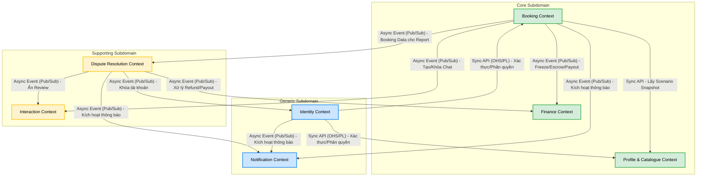

# PHÂN CHIA SUBDOMAIN & BOUNDED CONTEXTS

Dựa trên quá trình phân tích Domain-Driven Design (DDD) - Event Storming, các thành phần của hệ thống Rent-a-Girlfriend được phân loại thành các Subdomain và Bounded Contexts. Tài liệu này định nghĩa ranh giới kiến trúc độc lập, sở hữu dữ liệu (Aggregates), luồng nghiệp vụ (Policies), và cách các Context giao tiếp với nhau (Context Map).

---

## 1. PHÂN CHIA SUBDOMAIN

Việc phân định này giúp định hướng kiến trúc Microservices và chiến lược phát triển (Tự xây dựng hay tích hợp giải pháp có sẵn).

### 1.1. Core Subdomain
Đây là khu vực tạo ra lợi thế cạnh tranh lớn nhất và mang lại giá trị cốt lõi cho người dùng. Đội ngũ phát triển cần đầu tư tối đa nguồn lực vào việc tối ưu hóa và xây dựng các tính năng tại đây.
*   **Booking Context:** Trái tim nghiệp vụ của nền tảng, chịu trách nhiệm điều phối toàn bộ State Machine của lịch hẹn (từ lúc tạo yêu cầu, khóa coin, phản hồi, xử lý hủy lịch/vi phạm, đến khi hoàn thành).
*   **Profile & Catalogue Context:** Nơi Companion quản lý hồ sơ cá nhân, kho media, và đặc biệt là kịch bản dịch vụ (Scenario) - selling point khác biệt của nền tảng.
*   **Finance Context:** Quản lý toàn bộ vòng đời của dòng tiền ảo (Kano-Coin), bao gồm: số dư ví, lịch sử giao dịch nạp tiền, đóng băng tiền (Escrow), đối soát thanh toán (Payout) và thu hoa hồng.

### 1.2. Supporting Subdomain
Khu vực này hỗ trợ trực tiếp cho Core Subdomain. Chúng rất cần thiết để nền tảng hoạt động trơn tru, nhưng không phải là lợi thế cạnh tranh khác biệt.
*   **Interaction Context:** Chịu trách nhiệm xử lý các tương tác sau khi kết nối thành công, bao gồm giao tiếp (Phòng chat) và Đánh giá (Review) dịch vụ.
*   **Dispute Resolution Context:** Hỗ trợ Admin tiếp nhận khiếu nại (Report/Dispute) từ người dùng và phân xử để quyết định dòng tiền (Refund cho Client hoặc Payout cho Companion).

### 1.3. Generic Subdomain
Đây là các bài toán kỹ thuật chung, không mang yếu tố đặc thù của dự án và hoàn toàn có thể (hoặc nên) tích hợp hệ thống bên thứ ba.
*   **Identity Context:** Xử lý xác thực đăng nhập (Google OAuth), quản lý thông tin tài khoản cơ bản, vai trò người dùng, và trạng thái khóa/mở khóa tài khoản.
*   **Notification Context:** Quản lý tập trung hạ tầng và logic gửi thông báo đa kênh (SSE, FCM, Email).

---

## 2. CONTEXT MAP & LUỒNG GIAO TIẾP (UPSTREAM/DOWNSTREAM)

Sơ đồ dưới đây mô tả mối quan hệ (Upstream/Downstream) và luồng giao tiếp giữa các Bounded Context thông qua Domain Events hoặc API/Data cung cấp:

---

## 3. CHI TIẾT CÁC BOUNDED CONTEXTS

### 3.1. Booking Context (Core)
*   **Trách nhiệm:** "Trái tim" nghiệp vụ của nền tảng. Điều phối toàn bộ vòng đời (State Machine) của một lịch hẹn: từ lúc yêu cầu, chờ duyệt, chấp nhận, hủy, cho đến khi hoàn thành.
*   **Ubiquitous Language:** Từ "Booking" mang ý nghĩa là một cỗ máy trạng thái (State Machine) điều phối toàn bộ vòng đời của lịch hẹn thực tế.
*   **Aggregates chính:** `Booking`
*   **Tương tác & Chính sách (Policies):**
    *   Chỉ đạo **Finance Context** thực hiện việc giữ tiền (Freeze/Escrow) và thanh toán thông qua Domain Events.
    *   Chỉ đạo **Interaction Context** mở hoặc khóa phòng chat dựa theo trạng thái cuộc hẹn.
    *   Kiểm soát các quy tắc tự động hóa: Timeout quá hạn duyệt, Tự động hoàn thành sau khi kết thúc.

### 3.2. Profile & Catalogue Context (Core)
*   **Trách nhiệm:** Nơi Companion xây dựng và quản lý thương hiệu cá nhân để thu hút Client. Quản lý danh mục dịch vụ (Scenario) và các tài sản truyền thông (Media).
*   **Aggregates chính:** `CompanionProfile`, `MediaAsset`, `Scenario`
*   **Tương tác & Chính sách (Policies):**
    *   Kiểm duyệt tính hợp lệ của Voice Intro tự động.
    *   Cung cấp dữ liệu qua **Sync API** (Snapshot của Scenario) cho **Booking Context** khi Client tiến hành đặt lịch để đảm bảo tính bất biến của giá cả và dịch vụ lúc đặt.

### 3.3. Identity Context (Generic)
*   **Trách nhiệm:** Xử lý xác thực người dùng, định danh tài khoản, phân quyền (Client/Companion/Admin) và quản lý trạng thái đóng/mở tài khoản. Xử lý quy trình xét duyệt Onboarding.
*   **Aggregates chính:** `UserAccount`
*   **Tương tác & Chính sách (Policies):**
    *   Tích hợp bên ngoài với **Google OAuth**.
    *   Lắng nghe tín hiệu từ **Dispute Resolution Context** thông qua **Async Event** để tiến hành khóa tài khoản nếu Companion đạt ngưỡng vi phạm tối đa.

### 3.4. Finance Context (Core)
*   **Trách nhiệm:** Quản lý toàn bộ hệ sinh thái tài chính ảo (Kano-Coin). Chịu trách nhiệm trực tiếp cho thao tác tính toán số dư, nạp tiền, giữ tiền đặt cọc (Escrow) và chia sẻ hoa hồng.
*   **Ubiquitous Language:** Từ "Booking" trong context này chỉ mang ý nghĩa là một "lý do" hoặc "mã tham chiếu" để giải thích việc tại sao tiền bị đóng băng (Freeze/Escrow) hay giải ngân (Payout).
*   **Aggregates chính:** `Wallet`, `Transaction`, `Escrow`
*   **Tương tác & Chính sách (Policies):**
    *   Tích hợp cổng thanh toán **VNPay** qua IPN.
    *   Hoàn toàn thụ động, chỉ phản ứng dựa trên các **Async Event (Pub/Sub)** sinh ra từ **Booking Context** hoặc quyết định của Admin từ **Dispute Resolution Context**.

### 3.5. Interaction Context (Supporting)
*   **Trách nhiệm:** Cung cấp môi trường giao tiếp an toàn (Phòng chat) và hệ thống ghi nhận chất lượng dịch vụ (Đánh giá) sau khi có kết nối giữa hai bên.
*   **Aggregates chính:** `ChatRoom`, `Review`
*   **Tương tác & Chính sách (Policies):**
    *   Chỉ tạo/khóa Chat khi nhận tín hiệu thay đổi trạng thái từ **Booking Context** hoặc có khiếu nại từ **Dispute Resolution Context**.
    *   Kiểm soát quy tắc đánh giá 1 lần duy nhất, không chỉnh sửa. Ẩn Review nếu Admin phán quyết Refund cho Client.

### 3.6. Dispute Resolution Context (Supporting)
*   **Trách nhiệm:** Bộ máy giải quyết xung đột (Khiếu nại/Report) của nền tảng, đảm bảo tính công bằng và thu thập ghi nhận vi phạm để duy trì chất lượng hệ thống.
*   **Aggregates chính:** `Dispute`
*   **Tương tác & Chính sách (Policies):**
    *   Cung cấp các phán quyết cuối cùng để **Finance Context** xuất tiền (Refund/Payout), **Interaction Context** (ẩn Review/khóa Chat), và **Identity Context** (cộng vi phạm/khóa tài khoản).

### 3.7. Notification Context (Generic)
*   **Trách nhiệm:** Quản lý tập trung hạ tầng phân phối thông báo đa kênh (SSE, FCM, Email). Tách rời mối bận tâm về hệ thống thông báo khỏi các context nghiệp vụ.
*   **Aggregates chính:** `Notification`, `NotificationTemplate`
*   **Tương tác & Chính sách (Policies):**
    *   Lắng nghe (Subscribe) các Domain Events từ **Booking Context**, **Identity Context** và **Dispute Resolution Context** để kích hoạt tiến trình gửi thông báo.
    *   Xử lý chiến lược fallback giữa các kênh (ví dụ: gửi SSE trước, nếu Client offline thì fallback gửi qua FCM hoặc Email).
