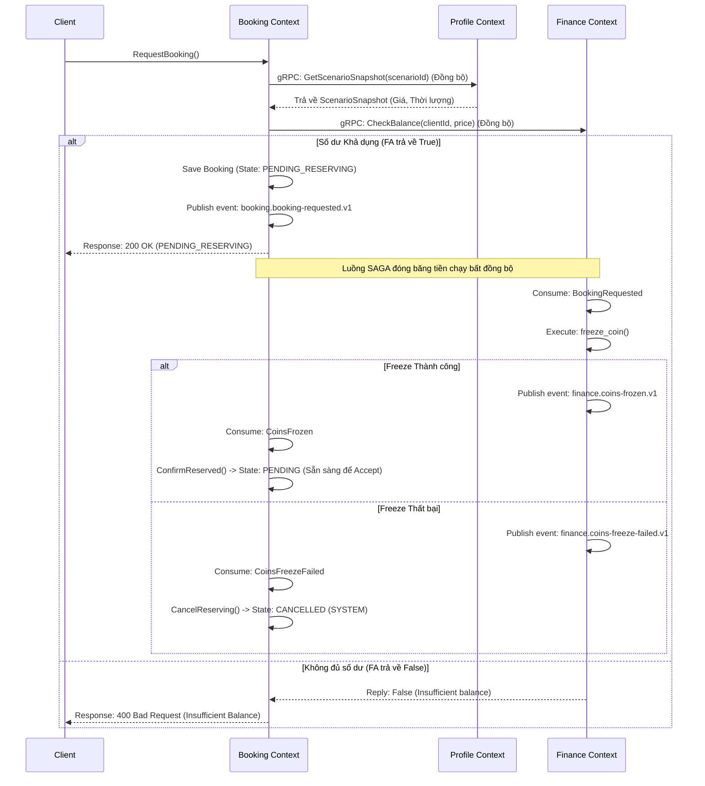
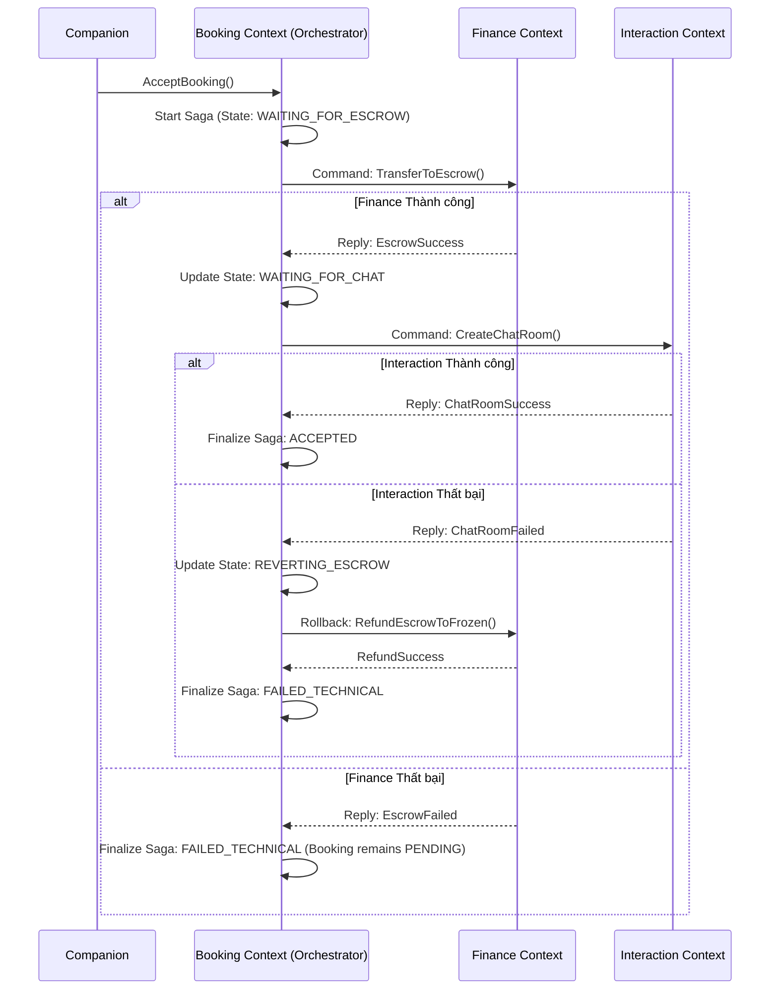
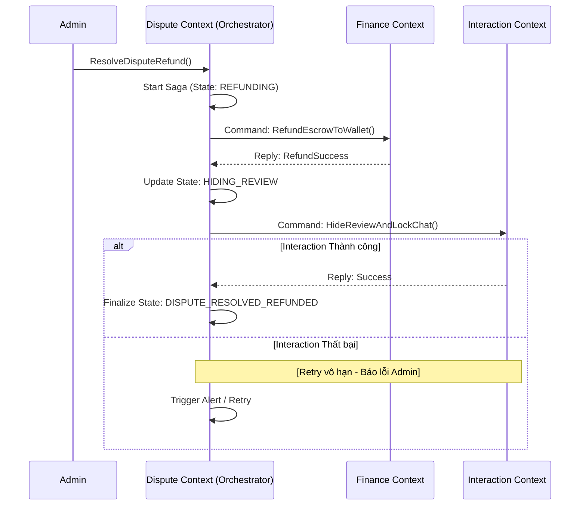
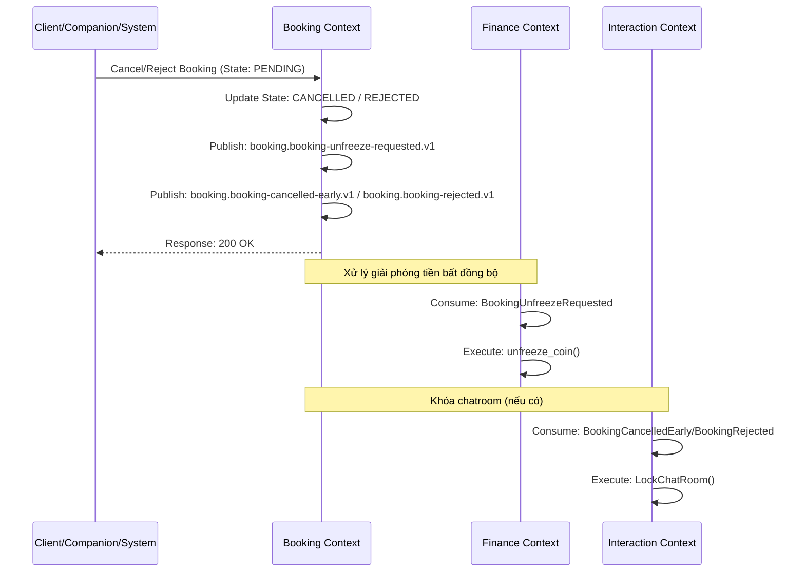
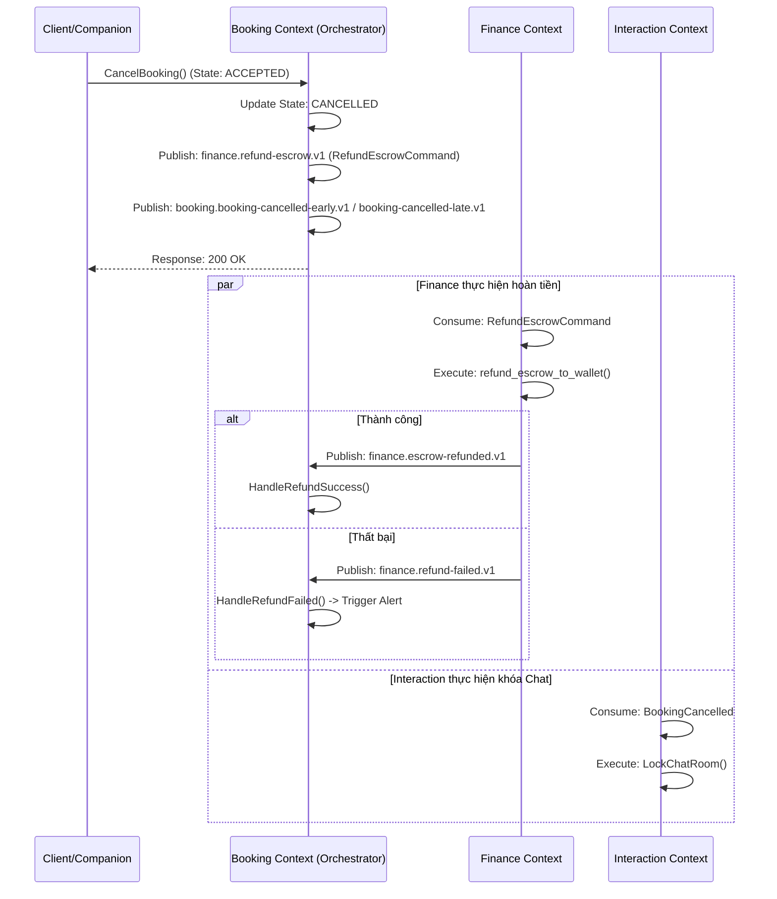

# SAGA WORKFLOWS (QUẢN LÝ GIAO DỊCH PHÂN TÁN)

Hệ thống sử dụng mẫu thiết kế SAGA (cả Orchestration và Choreography) để xử lý các nghiệp vụ xuyên suốt nhiều Bounded Context.

---

## 1. LUỒNG BOOKING REQUEST (COIN FREEZE SAGA)
*   **Mô hình:** Lai (Hybrid) giữa **Đồng bộ (Synchronous gRPC)** và **Bất đồng bộ (SAGA Choreography)**.
*   **Chủ thể:** `Booking Context`, `Profile Context` và `Finance Context`.
*   **Đặc điểm:** 
    *   Khi Client yêu cầu đặt lịch hẹn, `Booking Context` đầu tiên sẽ thực hiện một cuộc gọi **gRPC đồng bộ** sang `Profile Context` (`GetScenarioSnapshot(scenarioId)`) để lấy snapshot của kịch bản hẹn hò (chứa thông tin Giá và Thời lượng thực tế tại thời điểm đặt lịch).
    *   Sau khi nhận được giá tiền từ snapshot, `Booking Context` thực hiện cuộc gọi **gRPC đồng bộ** sang `Finance Context` để kiểm tra xem số dư tài khoản khả dụng của Client có đủ thanh toán cho booking này hay không.
    *   Nếu kiểm tra gRPC trả về `true` (đủ số dư khả dụng), hệ thống tiếp tục lưu booking vào database với trạng thái **`BOOKING_STATUS_PENDING_RESERVING`**, đẩy event `booking.booking-requested.v1` vào Outbox và trả về phản hồi thành công (200 OK) cho người dùng ngay lập tức.
    *   Sau đó, tiến trình thực tế đóng băng tiền (Freeze Coin) được thực hiện **bất đồng bộ** thông qua SAGA Choreography để tối ưu hiệu năng và tránh lock luồng lâu.

### Sequence Diagram

---

## 2. LUỒNG BOOKING ACCEPT (COMPANION ACCEPT)
*   **Mô hình:** **SAGA Orchestration** (Điều phối trung tâm).
*   **Orchestrator:** `Booking Context`.
*   **Đặc điểm:** Yêu cầu tính nhất quán cao giữa Tiền (`Escrow`) và Quyền lợi (`ChatRoom`). Nếu tiền không vào quỹ đảm bảo thành công, tuyệt đối không được mở chat. Nếu mở Chat thất bại, tiền phải được hoàn trả về Ví.

### Sequence Diagram

---

## 2. LUỒNG DISPUTE RESOLUTION (KHIẾU NẠI)
*   **Mô hình:** **SAGA Orchestration**.
*   **Orchestrator:** `Dispute Context`.
*   **Đặc điểm:** Tùy theo phán quyết của Admin là Refund hay Payout. Đặc thù của Dispute SAGA là **Không Rollback Tiền**. Nếu thao tác ở Chat lỗi (ẩn review, khóa chat), hệ thống dùng Retry vô hạn chứ không trừ tiền ngược lại.

### Luồng Refund (Hoàn tiền cho Client)

### Luồng Payout (Thanh toán cho Companion)
Tương tự Refund, Dispute gọi Finance để `PayoutFromEscrow()`, sau đó gọi Interaction để `LockChatRoom()`. Trạng thái cuối là `DISPUTE_RESOLVED_PAID_OUT`.

---

## 3. LUỒNG HỦY VÀ HOÀN TẤT (CANCELLATION & COMPLETION)
*   **Mô hình:** **SAGA Choreography** kết hợp **SAGA Orchestration** (ở luồng hoàn Escrow).
*   **Đặc điểm:** 
    *   **Trạng thái PENDING (Tiền bị đóng băng):** Giải phóng tiền hoàn toàn bất đồng bộ bằng cách phát sự kiện `booking.booking-unfreeze-requested.v1`.
    *   **Trạng thái ACCEPTED (Tiền trong Escrow):** Sử dụng Saga Command `finance.refund-escrow.v1` để yêu cầu Finance hoàn trả, sau đó lắng nghe phản hồi thành công/thất bại để cập nhật trạng thái hoặc nâng cảnh báo.

### A. Hủy/Từ chối Booking ở trạng thái PENDING (Tiền đang bị đóng băng)
*   **Hành động:** Client hủy hoặc Companion/Hệ thống từ chối (Reject/Timeout).
*   **Sự kiện phát ra:** `BookingCancelledEarly` (nếu hủy) hoặc `BookingRejected` / `BookingCancelled` cùng với `booking.booking-unfreeze-requested.v1`.
*   **Xử lý tại Finance:** Lắng nghe `booking.booking-unfreeze-requested.v1` để tự động giải phóng (unfreeze) số coin tương ứng của Client.

### B. Hủy Booking ở trạng thái ACCEPTED (Tiền đang trong Escrow)
*   **Hành động:** Client hoặc Companion yêu cầu hủy booking đã được chấp nhận.
*   **Saga Orchestration:** 
    *   `Booking Context` cập nhật trạng thái booking thành `CANCELLED`.
    *   `Booking Context` phát lệnh `finance.refund-escrow.v1` (`RefundEscrowCommand`).
    *   `Finance Context` xử lý hoàn tiền từ Escrow về ví và trả lời bằng `finance.escrow-refunded.v1` (thành công) hoặc `finance.refund-failed.v1` (thất bại).
    *   `Interaction Context` lắng nghe sự kiện hủy để khóa chatroom.

### Luồng Unfreeze Coin bất đồng bộ (Do sự kiện CoinsFrozen về chậm khi Booking đã bị hủy)
*   **Mục đích**: Giải phóng tiền cho Client khi sự kiện đóng băng tiền thành công `finance.coins-frozen.v1` trả về muộn (khi Booking ở `Booking Context` đã bị hủy hoặc từ chối trước đó).
*   `Booking Context` phát command **`finance.unfreeze-coin.v1`** bất đồng bộ (thay thế cuộc gọi gRPC đồng bộ để tránh nghẽn connection pool database).
*   `Finance Context` lắng nghe command này, thực hiện mở khóa tiền (`unfreeze_coin()`) và ghi nhận giao dịch `REFUND`.
*   Sau khi mở khóa thành công, `Finance Context` phát đi event `finance.coins-unfrozen.v1`.

### Luồng Booking Complete
*   `Booking Context` phát sự kiện `BookingCompleted` sau khi kết thúc thời gian + khoảng chờ (VD: 12h).
*   `Finance Context` lắng nghe: Tiến hành trừ hoa hồng nền tảng và Payout tiền về ví Companion.
*   `Interaction Context` lắng nghe: Tự thực hiện khóa Chat (sau 24h).

