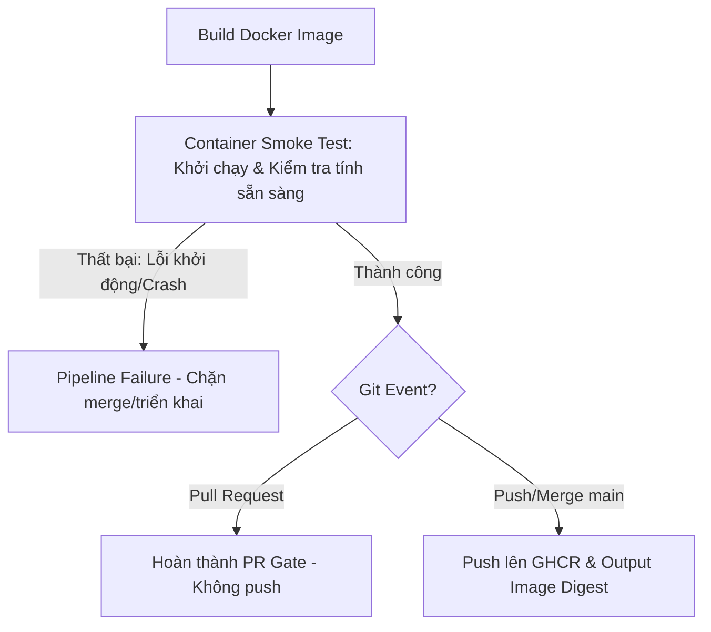

# 🐳 QUY CHUẨN CI DOCKER PHỤC VỤ TRIỂN KHAI GITOPS

Dự án **Rent-a-Girlfriend Platform** áp dụng mô hình triển khai liên tục tự động **GitOps** trực tiếp từ nhánh chính `main`. Để đảm bảo tính bất biến (Immutability), an toàn hệ thống và tốc độ phản hồi nhanh, quy trình đóng gói container (Docker build & push) bắt buộc phải tuân thủ các quy chuẩn kỹ thuật nghiêm ngặt sau.

---

## 1. NGUYÊN TẮC THIẾT KẾ WORKFLOW (CORE PRINCIPLES)

### Tích hợp và Quản lý Tập trung (Unified Workflows)
*   **Không tạo file riêng:** Không thiết lập tệp workflow riêng lẻ dạng `[service-name]-docker.yml`.
*   **Gộp chung:** Tác vụ đóng gói Docker phải được viết dưới dạng một job có tên `build-image` nằm trực tiếp trong tệp cấu hình CI hiện có của từng microservice (`.github/workflows/[service-name]-ci.yml`).
*   **Ràng buộc chất lượng:** Sử dụng thuộc tính `needs: lint-and-test` (hoặc tên job kiểm duyệt tương ứng) để đảm bảo job `build-image` chỉ chạy khi toàn bộ các cổng kiểm tra chất lượng (Linter, Formatter, Unit/Integration Tests) đã vượt qua thành công.

### Phạm vi kích hoạt (Triggers)
*   Chỉ áp dụng và kích hoạt khi có thay đổi trên nhánh **`main`** hoặc trên các **Pull Request (PR)** hướng tới nhánh `main`.
*   Áp dụng **Path Filtering** thông minh: Chỉ kích hoạt khi phát hiện thay đổi trong thư mục của chính microservice đó (`services/[service-name]/**`) hoặc hợp đồng dữ liệu dùng chung (`contracts/**`).

---

## 2. CHIẾN LƯỢC ĐỊNH DANH VÀ GITOPS DEPLOYMENT

Để hỗ trợ hệ thống GitOps vận hành an toàn tuyệt đối và chống lại các rủi ro giả mạo hoặc ghi đè tag, dự án thống nhất phương án triển khai như sau:

### Chốt Sử dụng Image Digest cho GitOps Deployment
*   **Bất biến tuyệt đối:** Trong tệp cấu hình GitOps (K8s Manifests), **bắt buộc chốt sử dụng duy nhất định danh Image Digest (`[image-path]@[digest-hash]`)** làm định danh để triển khai trên các môi trường. Định dạng tag động (như `:latest`) hoặc tag commit (như `:sha-[commit-sha]`) chỉ dùng để tham chiếu nhanh bằng mắt thường và tra cứu lịch sử, tuyệt đối không dùng trong tệp triển khai GitOps chính thức.
*   **Yêu cầu ghi nhận Digest:** Cuối mỗi job `build-image` thành công, workflow bắt buộc phải thực hiện bước **in ra (output) mã băm Docker Image Digest (SHA256)** trong log của GitHub Actions run. Các script GitOps tự động hóa (hoặc kỹ sư DevOps) sẽ đọc mã băm này để cập nhật tệp manifest.

---

## 3. KỊCH BẢN THỰC THI & KIỂM THỬ KHỞI CHẠY CONTAINER (SMOKE TEST)

Để đảm bảo Docker image build ra thực sự chạy được và không bị lỗi khởi động (crash loop) khi lên cụm Kubernetes, quy trình CI bắt buộc phải tích hợp bước **Container Smoke Test (Kiểm thử khởi chạy)** trước khi kết thúc job:

### Tiêu chuẩn kiểm thử Image Smoke Test:
*   **Yêu cầu bắt buộc:** Ngay sau khi build xong Docker image, CI pipeline phải thực hiện khởi chạy thử container từ chính image vừa build và tiến hành xác thực tính sẵn sàng.
*   **Tiêu chí nghiệm thu:** Đảm bảo container khởi chạy thành công, sẵn sàng xử lý yêu cầu và không tự động thoát (exit code khác 0) hoặc bị rơi vào vòng lặp lỗi khởi động (crash loop).
*   **Tính linh hoạt:** Cách thức và giải pháp kỹ thuật cụ thể để xác thực (ví dụ: kiểm tra cổng lắng nghe, gọi endpoint healthcheck, v.v.) sẽ do từng microservice tự quyết định dựa trên ngôn ngữ lập trình và giao thức giao tiếp được sử dụng (gRPC, HTTP/REST).
*   **Dọn dẹp:** Phải tự động dừng và xóa sạch tài nguyên container chạy thử sau khi hoàn thành kiểm tra để giải phóng tài nguyên hệ thống.

---

## 4. TỐI ƯU HÓA HIỆU NĂNG (PERFORMANCE GUIDELINES)

Người triển khai được tự do quyết định giải pháp kỹ thuật cụ thể cho từng microservice, nhưng bắt buộc phải áp dụng các cơ chế tối ưu hiệu năng để giảm thiểu tối đa thời gian build:
*   **Sử dụng Multi-stage build:** Giảm thiểu dung lượng Docker image cuối cùng (ví dụ: sử dụng alpine hoặc distroless cho runtime stage).
*   **Docker Cache backend:** Khuyên dùng các cơ chế lưu cache layer (như GitHub Actions cache `type=gha,mode=max` hoặc buildx caching) để khôi phục nhanh chóng các bước cài đặt dependency không thay đổi.
