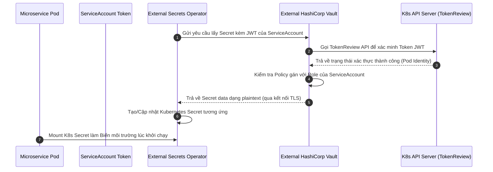

# 🔑 QUY CHUẨN QUẢN LÝ SECRET HỆ THỐNG (SECRET MANAGEMENT STANDARDS)

Dự án **Rent-a-Girlfriend Platform** áp dụng cơ chế quản lý secret tập trung, bảo mật và tuân thủ tuyệt đối triết lý GitOps thông qua việc tích hợp **External Secrets Operator (ESO)** và **HashiCorp Vault** chạy ngoài cụm (External Vault).

Tài liệu này hướng dẫn chi tiết kiến trúc, cách cấu hình và quy chuẩn tích hợp dành cho nhà phát triển và kỹ sư vận hành (DevOps).

---

## 1. KIẾN TRÚC TỔNG QUAN (ARCHITECTURE OVERVIEW)

Thay vì lưu trữ secret dưới dạng plaintext trong Git hoặc truyền thủ công qua CI/CD pipeline, chúng ta sử dụng cơ chế kéo secret tự động (Pull-based) từ Vault ngoài cụm dựa trên định danh của Kubernetes Pod (`ServiceAccount`).



---

## 2. HƯỚNG DẪN CẤU HÌNH TRÊN HASHICORP VAULT (VAULT CONFIGURATION)

Để chuẩn bị cho việc kết nối, Kỹ sư vận hành cần thiết lập trên cụm Vault ngoài theo các bước sau:

### Bước 2.1. Kích hoạt Kubernetes Auth Method
```bash
# Kích hoạt auth method kubernetes
vault auth enable kubernetes
```

### Bước 2.2. Liên kết Vault với Kubernetes Cluster
Cấu hình để Vault có thể giao tiếp ngược lại với Kubernetes API Server nhằm kiểm tra tính hợp lệ của token:
```bash
vault write auth/kubernetes/config \
    kubernetes_host="https://<KUBERNETES_API_SERVER_ADDRESS>:443" \
    kubernetes_ca_cert="<KUBERNETES_CA_CERTIFICATE_CONTENT>"
```

### Bước 2.3. Tạo Policy phân quyền tối thiểu (Least Privilege)
Tạo chính sách chỉ cho phép đọc secret thuộc đường dẫn của service đó. Ví dụ, tạo policy cho `identity-service` lưu tại file `identity-service-policy.hcl`:
```hcl
# Cho phép đọc thông tin secret từ path của identity-service
path "secret/data/dev/identity-service" {
  capabilities = ["read"]
}
path "secret/data/prod/identity-service" {
  capabilities = ["read"]
}
```
Nạp policy vào Vault:
```bash
vault policy write identity-service-policy identity-service-policy.hcl
```

### Bước 2.4. Tạo Vault Auth Role liên kết với ServiceAccount
Tạo liên kết giữa ServiceAccount trong Kubernetes cluster với Policy vừa tạo:
```bash
vault write auth/kubernetes/role/identity-service-role \
    bound_service_account_names=identity-service-sa \
    bound_service_account_namespaces=identity-service \
    policies=identity-service-policy \
    ttl=1h
```

---

## 3. CẤU HÌNH HẠ TẦNG KUBERNETES (GLOBAL GITOPS MANIFESTS)

Chúng ta triển khai duy nhất một `ClusterSecretStore` toàn cục dùng chung cho toàn bộ cluster. Tài liệu cấu hình này được lưu trữ trong GitOps Repository tại `infra/k8s/base/vault-clustersecretstore.yaml`.

```yaml
apiVersion: external-secrets.io/v1beta1
kind: ClusterSecretStore
metadata:
  name: global-vault-store
spec:
  provider:
    vault:
      server: "https://vault.example.com" # Địa chỉ external Vault
      path: "secret"
      version: "v2"
      auth:
        kubernetes:
          mountPath: "kubernetes"
          # Sử dụng tên role đã cấu hình ở Vault tương ứng với ServiceAccount của Pod gọi tới
          role: "k8s-auth-role"
          serviceAccountRef:
            # Không khai báo namespace ở đây để tự động kế thừa ServiceAccount
            # từ namespace của tài nguyên ExternalSecret gọi tới
            name: app-service-account
```

---

## 4. QUY CHUẨN TÍCH HỢP CHO MICROSERVICE (HELM CHART STANDARDS)

Để tích hợp một microservice mới vào hệ thống quản lý secret này, lập trình viên thực hiện sửa đổi Helm Chart theo quy chuẩn dưới đây:

### Bước 4.1. Khai báo biến cấu hình trong `values.yaml`
Cung cấp tùy chọn bật/tắt ESO linh hoạt (cho phép fallback về Secret tĩnh khi chạy thử nghiệm offline):

```yaml
# values.yaml
externalSecrets:
  enabled: false                      # Mặc định tắt để test offline dễ dàng
  secretStoreName: global-vault-store # Tên ClusterSecretStore toàn cục
  vaultPath: dev/identity-service     # Đường dẫn lưu secret tương ứng trên Vault
```

### Bước 4.2. Tạo mẫu `externalsecret.yaml`
Tạo tệp [externalsecret.yaml](file:///f:/Rent-a-Girlfriend/services/identity-service/deployments/templates/k8s/externalsecret.yaml) trong thư mục `templates/k8s/` của Helm Chart:

```yaml
{{- if .Values.externalSecrets.enabled }}
apiVersion: external-secrets.io/v1beta1
kind: ExternalSecret
metadata:
  name: {{ include "service-name.fullname" . }}-secrets
  labels:
    {{- include "service-name.labels" . | nindent 4 }}
spec:
  refreshInterval: 1h # Tần suất kiểm tra cập nhật từ Vault (tránh rate limit)
  secretStoreRef:
    name: {{ .Values.externalSecrets.secretStoreName }}
    kind: ClusterSecretStore
  target:
    name: {{ include "service-name.fullname" . }}-secrets
    creationPolicy: Owner
  data:
    # Định nghĩa tường minh các key cần thiết
    - secretKey: DB_URL
      remoteRef:
        key: {{ .Values.externalSecrets.vaultPath }}
        property: DB_URL
    - secretKey: REDIS_URL
      remoteRef:
        key: {{ .Values.externalSecrets.vaultPath }}
        property: REDIS_URL
{{- end }}
```

### Bước 4.3. Cập nhật `secret.yaml` tĩnh hiện có
Đảm bảo Secret tĩnh không được khởi tạo khi đã kích hoạt `externalSecrets`:

```yaml
# templates/k8s/secret.yaml
{{- if and .Values.secrets (not .Values.externalSecrets.enabled) }}
apiVersion: v1
kind: Secret
metadata:
  name: {{ include "service-name.fullname" . }}-secrets
...
{{- end }}
```

### Bước 4.4. Giữ nguyên cấu hình `deployment.yaml`
Nhờ cơ chế đặt tên Kubernetes Secret đồng nhất (`{{ include "service-name.fullname" . }}-secrets`), tệp `deployment.yaml` sẽ **không cần thay đổi bất kỳ dòng code nào**. Nó tự động mount dữ liệu từ K8s Secret (do ESO sinh ra hoặc do Helm Chart sinh ra tĩnh).

---

## 5. TIÊU CHUẨN LOCAL DEVELOPMENT (LOCAL DEVELOPMENT STANDARDS)

Để tránh làm chậm tốc độ phát triển và tạo ra sự phụ thuộc phức tạp vào hạ tầng Vault thật, toàn bộ lập trình viên bắt buộc phải:

1. **Tuyệt đối không** cấu hình kết nối Vault trên máy local để debug code hàng ngày.
2. Sử dụng tệp tin `.env` cục bộ (sao chép từ `.env.example`).
3. Đảm bảo `.env` đã được liệt kê trong `.gitignore` để tránh commit nhầm mật khẩu mock lên Git.
4. Sử dụng các container cơ sở dữ liệu/mock service chạy độc lập qua Docker Compose local (`docker-compose.yml`) làm đích kết nối trong `.env`.
