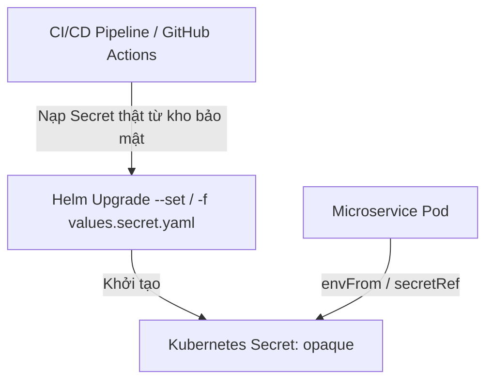

# 🔑 QUY CHUẨN QUẢN LÝ SECRET HỆ THỐNG (SECRET MANAGEMENT STANDARDS)

Dự án **Rent-a-Girlfriend Platform** áp dụng cơ chế quản lý secret trực tiếp thông qua **Native Kubernetes Secrets** (`kind: Secret` với `type: Opaque`). Quyết định này giúp tối giản hóa hạ tầng triển khai, loại bỏ sự phụ thuộc vào các operator bên thứ ba như External Secrets Operator (ESO) và các dịch vụ lưu trữ ngoài cụm như HashiCorp Vault.

Tài liệu này hướng dẫn chi tiết cách cấu hình, tích hợp và các quy chuẩn bảo mật khi làm việc với Secret trong cụm Kubernetes và quy trình GitOps.

---

## 1. KIẾN TRÚC TỔNG QUAN (ARCHITECTURE OVERVIEW)

Secret được định nghĩa trực tiếp dưới dạng các đối tượng Kubernetes Secret của từng namespace tương ứng. 



Để tuân thủ triết lý GitOps mà vẫn đảm bảo an toàn thông tin nhạy cảm:
1. **Không bao giờ commit plaintext secrets lên Git:** Tất cả tệp tin chứa giá trị secret thật (như `values.secret.yaml`) đều phải nằm trong `.gitignore`.
2. **Khai báo Schema/Placeholders trong Git:** Định nghĩa khóa (key) nhưng để trống giá trị (value) trong `values.yaml` của Helm Chart để làm mẫu cấu hình.
3. **Nạp secret động lúc Deploy:** CI/CD pipeline hoặc Quản trị viên hệ thống sẽ nạp các giá trị thực tế vào cụm thông qua tham số Helm hoặc áp dụng tệp tin cấu hình secret cục bộ.

---

## 2. QUY CHUẨN TÍCH HỢP CHO MICROSERVICE (HELM CHART STANDARDS)

Để triển khai một microservice mới cần sử dụng secret, lập trình viên thực hiện theo các quy chuẩn dưới đây:

### Bước 2.1. Định nghĩa khóa secret trong `values.yaml`
Khai báo cấu trúc các biến nhạy cảm dưới dạng khóa trống để định hình schema cấu hình:

```yaml
# values.yaml
secrets:
  DB_URL: ""
  REDIS_URL: ""
  # Thêm các cấu hình nhạy cảm khác tại đây
```

### Bước 2.2. Tạo file template `secret.yaml`
Tạo tệp `secret.yaml` trong thư mục `templates/k8s/` của Helm Chart để sinh K8s Secret từ các giá trị cấu hình:

```yaml
apiVersion: v1
kind: Secret
metadata:
  name: {{ include "service-name.fullname" . }}-secrets
  labels:
    {{- include "service-name.labels" . | nindent 4 }}
type: Opaque
stringData:
{{- with .Values.secrets }}
{{- toYaml . | nindent 2 }}
{{- end }}
```

### Bước 2.3. Mount Secret vào `deployment.yaml`
Sử dụng `envFrom` để tự động nạp tất cả các key-value từ K8s Secret thành biến môi trường trong container:

```yaml
# templates/k8s/deployment.yaml
spec:
  containers:
    - name: {{ .Chart.Name }}
      # ... các cấu hình khác ...
      envFrom:
        - configMapRef:
            name: {{ include "service-name.fullname" . }}-config
        - secretRef:
            name: {{ include "service-name.fullname" . }}-secrets
```

---

## 3. TRIỂN KHAI TRÊN MÔI TRƯỜNG MÁY CÁ NHÂN (LOCAL DEVELOPMENT STANDARDS)

Khi làm việc hoặc kiểm thử Helm Chart cục bộ (ví dụ: trên Minikube hoặc Kind):

1. Sao chép tệp tin mẫu `values.secret.yaml.example` thành `values.secret.yaml` (tệp này đã được đưa vào `.gitignore` toàn cục).
2. Điền các giá trị môi trường phát triển cục bộ vào file `values.secret.yaml`.
3. Triển khai ứng dụng cục bộ bằng lệnh Helm kết hợp nạp file secret:
   ```bash
   helm upgrade --install identity-service ./deployments -f ./deployments/values.dev.yaml -f ./deployments/values.secret.yaml
   ```
4. Để chạy và debug code trực tiếp bằng IDE mà không thông qua Kubernetes, copy `.env.example` thành `.env` để nạp biến môi trường cục bộ.

---

## 4. QUY TRÌNH DEPLOY PRODUCTION / CI-CD GITOPS

Trên các môi trường dùng chung (Staging, Production) vận hành bởi GitOps (như FluxCD):

* **Phương án 1 (Khuyên dùng):** CI/CD pipeline (GitHub Actions) kéo secret từ GitHub Secrets hoặc Vault trung tâm của doanh nghiệp và chạy lệnh Helm upgrade trực tiếp với tham số `--set secrets.DB_URL=$PROD_DB_URL`.
* **Phương án 2 (FluxCD HelmRelease Decryption):** Sử dụng tính năng giải mã HelmRelease Sops của FluxCD để lưu trữ các file `values.secret.yaml` đã mã hóa bằng SOPS (sử dụng khóa AWS KMS/GCP KMS/Age) trực tiếp trên kho lưu trữ GitOps. FluxCD sẽ tự động giải mã secret khi cài đặt Chart.
