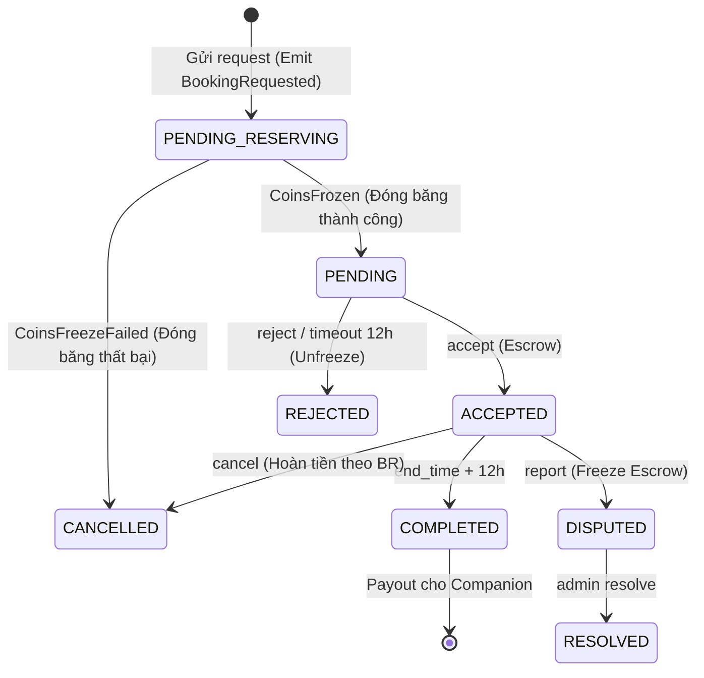

# BUSINESS REQUIREMENTS DOCUMENT (BRD)

## Rent-a-Girlfriend — Nền tảng Kết nối Dịch vụ Đồng hành Theo Kịch bản

---

## 1. TÓM TẮT DỰ ÁN

Nền tảng kết nối **Client** (người thuê) với **Companion** (người cung cấp dịch vụ thời gian) qua các **kịch bản trải nghiệm (Scenario)** được thiết kế sẵn.

Hệ thống hoạt động dựa trên Core Loop:
**Tìm Companion → Xem Profile → Đặt lịch → Gặp nhau → Đánh giá**

Hệ thống tập trung vào các cơ chế bảo vệ cơ bản cho giao dịch C2C:
- **Voice Intro:** Companion upload đoạn âm thanh giới thiệu bản thân (tối đa 30 giây, MP3) thay vì profile văn bản đơn thuần.
- **Booking Chat:** Phòng chat riêng được tạo sau khi booking được accept, tự động khóa sau 24h kể từ khi cuộc hẹn kết thúc.
- **Kano-Coin nội bộ:** Thanh toán qua ví nội bộ có cơ chế Freeze/Escrow đơn giản, tránh double-spending và giao dịch ngoài luồng.

---

## 2. MỤC TIÊU KINH DOANH

| Mã | Mục tiêu | Ưu tiên |
|:---:|:---|:---:|
| BO-01 | Hoàn thiện luồng booking từ tìm kiếm đến thanh toán nội bộ | Cao |
| BO-02 | Bảo vệ đôi bên qua Escrow và Booking Chat có thời hạn | Cao |
| BO-03 | Hệ thống đánh giá sao + bình luận sau cuộc hẹn | Trung bình |
| BO-04 | Admin Dashboard: duyệt Companion, giám sát giao dịch, xử lý khiếu nại | Trung bình |
| BO-05 | Chứng minh tính khả thi mô hình "dịch vụ đồng hành platonic an toàn" | Cao |

---

## 3. PHẠM VI DỰ ÁN

### 3.1. In-Scope
- Xác thực & phân quyền 3 role: Client, Companion, Admin (Auth qua Google OAuth).
- Profile Companion: Ảnh đại diện + album ảnh, Voice Intro (upload MP3, tối đa 30s, 5MB), Scenario tự thiết kế, Thành phố hoạt động.
- Quản lý lịch hẹn: Companion tự chủ Accept/Reject theo lịch cá nhân (không dùng Availability Window phức tạp).
- Booking Engine: Chọn Scenario → Chọn ngày/giờ mong muốn → Địa điểm công cộng → Gửi request.
- Ví Kano-Coin: Freeze khi request, Unfreeze khi reject/timeout, Escrow khi accept, Payout khi hoàn thành.
- Tích hợp thanh toán VNPay: Hỗ trợ nạp tiền vào ví Kano-Coin (Top-up) bằng cổng thanh toán VNPay.
- Booking Chat: Tạo phòng chat sau Accept, liên kết với booking; tự động khóa sau 24h kể từ khi hẹn kết thúc.
- Đánh giá: Sao + comment văn bản (đánh giá 1 lần duy nhất, không sửa/xóa, Companion không có quyền phản hồi).
- Admin Dashboard: Duyệt Companion (thủ công), quản lý user, xem giao dịch, xử lý dispute.
- Hệ thống Notification: Thông báo real-time cho các sự kiện booking, accept/reject, nhắc nhở hẹn.

### 3.2. Out-of-Scope

| Tính năng | Lý do |
|:---|:---|
| eKYC tự động (CCCD + Liveness) | Phụ thuộc API thương mại, không cần cho MVP |
| Blind Box Date | Thuật toán matching phức tạp, ngoài khung đồ án |
| SOS Panic Button (GPS + ghi âm) | Yêu cầu native mobile |
| Rút tiền thật (Cash-out) từ ví | Thu hẹp scope MVP, chỉ tập trung luồng nạp và tiêu dùng nội bộ |
| Voice Recorder trực tiếp trên trình duyệt | Tăng scope frontend; thay bằng upload file |
| Lọc nội dung chat / che SĐT / pattern detection | Giảm scope, không cần cho MVP |
| Đăng ký bằng email/password riêng | Chỉ dùng Google OAuth để giảm rủi ro spam/fake account |

---

## 4. CÁC BÊN LIÊN QUAN

| Nhóm | Vai trò | Nhu cầu chính |
|:---:|:---|:---|
| **Client** | Người thuê dịch vụ | Tìm Companion phù hợp, đặt lịch nhanh, thanh toán an toàn, đánh giá trải nghiệm |
| **Companion** | Người cung cấp dịch vụ | Tự chủ thiết kế kịch bản & giá, tự chủ nhận lịch hẹn, được bảo vệ khỏi quấy rối |
| **System Admin** | Quản trị viên | Kiểm soát chất lượng Companion, giám sát giao dịch, xử lý vi phạm |

---

## 5. YÊU CẦU CHỨC NĂNG CẤP CAO

| Mã | Yêu cầu | Actor | Mô tả |
|:---:|:---|:---:|:---|
| FR-01 | Xác thực & Phân quyền & Onboarding | Tất cả | Đăng nhập bằng Google OAuth; phân biệt 3 role: Client, Companion, Admin. Sau khi đăng nhập lần đầu, người dùng bắt buộc phải tạo hồ sơ thông tin cơ bản (mặc định có vai trò Client). Client có thể gửi yêu cầu nâng cấp lên Companion, yêu cầu này cần Admin phê duyệt thủ công. |
| FR-02 | Quản lý Profile Companion | Companion | CRUD thông tin cá nhân; upload 1 ảnh đại diện + tối đa 4 ảnh album (tổng cộng 5 ảnh, định dạng JPG/PNG, tối đa 2MB/ảnh); upload Voice Intro (MP3, tối đa 30s, 5MB); tạo Scenario; chọn Thành phố hoạt động. Sau khi nâng cấp, Companion được tự do chỉnh sửa hồ sơ mà không cần kiểm duyệt hồ sơ lại. |
| FR-03 | Theo dõi Lịch hẹn | Companion | Xem lịch các cuộc hẹn (Pending, Accepted) để tiện theo dõi và quyết định nhận/từ chối các request mới dựa trên lịch trình cá nhân. |
| FR-04 | Tìm kiếm Companion | Client | Tìm kiếm theo tên Companion, Thành phố, khoảng giá, địa điểm. Chỉ tìm kiếm và hiển thị các Companion đang có trạng thái **Approved**; kết quả hiển thị dạng card với ảnh đại diện, tên, Thành phố, giá của Scenario nổi bật. |
| FR-04b | Xem Profile Companion (Magazine View) | Client | Xem profile chi tiết dạng magazine: thông tin cá nhân, album ảnh, Voice Intro (nghe trực tiếp), danh sách Scenario, Thành phố, đánh giá sao trung bình, review gần nhất. |
| FR-05 | Booking Engine | Client | Chọn Scenario (đã bao gồm địa điểm do Companion định sẵn) → chọn ngày/giờ mong muốn → gửi request. |
| FR-06 | Quản lý Ví & Escrow | Client, System | **Freeze** coin khi gửi request; **Unfreeze** khi Companion reject hoặc timeout 12h; **Escrow** khi Companion accept; **Payout** khi hoàn thành. |
| FR-06b | Nạp Kano-Coin (Top-up) | Client | Tích hợp cổng thanh toán VNPay (Sandbox/Live) để nạp tiền vào ví Kano-Coin. Tỷ lệ quy đổi 1 Kano-Coin = 1,000 VNĐ. Tự động cập nhật số dư sau khi IPN webhook trả về thành công. |
| FR-07 | Xử lý Request | Companion | Xem danh sách request; Accept/Reject trong vòng 12h, hoặc trước thời điểm `start_time` - 1 giờ (tùy điều kiện nào đến trước). Nếu timeout, hệ thống tự động reject và unfreeze coin. |
| FR-08 | Booking Chat | Client, Companion | Phòng chat text được tạo sau Accept, gắn với booking; tự động khóa sau 24h kể từ khi hẹn kết thúc. |
| FR-09 | Đánh giá & Review | Client | Đánh giá sao (1-5) và viết comment sau cuộc hẹn. Client chỉ được đánh giá 1 lần duy nhất, không thể sửa hoặc xóa sau khi đã gửi. (Companion không có tính năng phản hồi) |
| FR-10 | Quản lý Doanh thu | Companion | Xem số dư ví, lịch sử giao dịch, coin nhận được. |
| FR-11 | Admin Dashboard | Admin | Duyệt Companion (thủ công), khóa/mở khóa user, xem giao dịch, xử lý dispute. |
| FR-12 | Hệ thống Thông báo | System | Gửi thông báo real-time qua **SSE (Server-Sent Events)** cho các sự kiện: booking mới, accept/reject, nhắc nhở trước hẹn 1h, gửi thông báo nhắc review ngay tại `end_time`. |
| FR-13 | Report & Khiếu nại (Dispute) | Client, Companion | Nút "Report" cho phép người dùng báo cáo vi phạm (như No-show, thái độ tệ, lừa đảo...) kèm lý do và text. Nếu một booking bị Report, quá trình tự động Payout sẽ bị tạm ngưng (đóng băng Escrow) cho đến khi Admin giải quyết xong. |

---

## 6. QUY TẮC NGHIỆP VỤ & RÀNG BUỘC

### 6.1. Tài chính
- **BR-01 (Tự chủ kịch bản & giá):** Companion tự thiết kế các Scenario (kịch bản), tự quyết định **Phí dịch vụ (Service Fee)** cho từng Scenario. Không giới hạn khung giá từ hệ thống. Phí này chỉ bao gồm tiền công của Companion.
- **BR-02 (Escrow):** Coin chuyển vào Escrow ngay khi Companion Accept. Không hoàn trả nếu Client no-show.
- **BR-03 (Hoa hồng):** Hệ thống khấu trừ tỷ lệ % (cấu hình được) trước khi chuyển coin vào ví Companion.
- **BR-04 (Định dạng Coin):** Kano-Coin là kiểu số nguyên (INT). (Hệ thống tính toán hoa hồng sẽ tự làm tròn).
  > 💡 **Lưu ý quy đổi tỉ giá:** Tỷ lệ quy đổi cố định: **1 Kano-Coin = 1,000 VNĐ**.

### 6.2. Hủy lịch và No-show
**Đối với Client:**
- **BR-05:** Hủy sớm (trước 24h so với giờ hẹn) → Hoàn 100% coin cho Client.
- **BR-06:** Hủy muộn (dưới 24h) hoặc No-show → Client mất 100% coin (khoản này bồi thường cho Companion).

**Đối với Companion:**
- **BR-07:** Hủy sớm (trước 24h) → Hoàn 100% coin cho Client. Không phạt Companion.
  - **BR-07a:** Hủy muộn (dưới 24h) hoặc No-show → Hoàn 100% coin cho Client. Companion bị hệ thống ghi nhận vi phạm (Tích lũy vi phạm sẽ bị khóa tài khoản hoặc trừ uy tín theo cấu hình Admin).

**Đối với Hệ thống (System):**
- **BR-07b (Hủy tự động do lỗi kỹ thuật/trùng lặp SAGA):** Nếu xảy ra lỗi kỹ thuật hoặc hệ thống phát hiện trùng lặp lịch đặt (khi hai cuộc hẹn chồng lặp cùng được chấp nhận tại một thời điểm), hệ thống sẽ tự động hủy cuộc hẹn với vai trò `SYSTEM` (hủy sớm), đóng phòng chat và hoàn trả 100% tiền từ quỹ đảm bảo (Escrow) về ví cho Client.

### 6.3. Đánh giá
- **BR-08:** Client được phép đánh giá ngay khi thời gian hiện tại đã đến hoặc vượt quá `end_time` của booking ở trạng thái ACCEPTED. Không cần chờ hệ thống chuyển sang COMPLETED.
  - **BR-08a:** Nếu một booking có review đã được gửi, sau đó chuyển sang trạng thái DISPUTED và Admin resolve với kết quả REFUND cho Client hoặc CANCEL booking, hệ thống tự động chuyển review sang trạng thái HIDDEN (soft delete khỏi public view). Review không bị xóa cứng trong DB để phục vụ audit.
  - **BR-08b:** Nếu Admin resolve dispute với kết quả vẫn payout cho Companion (Companion không vi phạm), review giữ nguyên trạng thái VISIBLE.
- **BR-09:** Mỗi cuộc hẹn chỉ cho phép Client đánh giá 1 lần duy nhất (sao + comment).
- **BR-10:** Không cho phép sửa/xóa đánh giá sau khi đã gửi. Companion không có tính năng phản hồi lại đánh giá của Client.

### 6.4. Voice Intro
- **BR-11:** File upload phải là định dạng MP3, tối đa 30 giây, dung lượng tối đa 5MB. Hệ thống từ chối nếu vượt quá giới hạn. Bất kỳ người dùng nào (kể cả chưa đăng nhập) đều có quyền nghe Voice Intro; không cho phép tải xuống.

### 6.5. Ảnh Profile
- **BR-12:** Companion được upload 1 ảnh đại diện + tối đa 4 ảnh album (tổng cộng 5 ảnh). Định dạng JPG/PNG, tối đa 2MB/ảnh.

### 6.6. Quản lý Lịch hẹn và Thời gian đặt trước
- **BR-13:** Hệ thống không sử dụng cửa sổ thời gian (Availability Window) với logic validation phức tạp. Companion hoàn toàn tự chủ quyết định Accept/Reject một booking mới dựa trên lịch cá nhân thực tế của họ.
- **BR-13a (Thời gian đặt trước tối thiểu):** Thời điểm bắt đầu cuộc hẹn (`start_time`) phải cách thời điểm gửi yêu cầu đặt lịch hẹn ít nhất **2 giờ** (`MinAdvanceBookingHours = 2`). Quy tắc này đảm bảo Companion có đủ thời gian chuẩn bị và giảm thiểu các yêu cầu đặt gấp ngoài mong muốn `[INV-B01]`.

### 6.7. Booking Chat
- **BR-14:** Phòng chat chỉ được tạo sau khi Companion Accept booking.
- **BR-15:** Phòng chat tự động khóa sau 24h kể từ thời điểm kết thúc cuộc hẹn (theo `end_time` của booking). Nếu booking bị Hủy (Cancel) hoặc có quyết định Refund từ Admin, phòng chat sẽ bị khóa ngay lập tức. Cả hai bên không thể gửi tin nhắn mới khi phòng chat bị khóa.

### 6.8. Xác định Hoàn thành và Xử lý Khiếu nại (Report/No-show)
- **BR-16:** Hệ thống tự động xác nhận hoàn thành cuộc hẹn khi đến `end_time` + 12 giờ (Buffer time) (Không sử dụng nút bấm "Xác nhận hoàn thành"). Nếu **không có Report/Dispute nào**, hệ thống tự động đánh dấu booking là "Hoàn thành" và thực hiện Payout.
- **BR-17:** Hành vi "No-show" (Không xuất hiện tại điểm hẹn) được gộp chung vào tính năng Report. Người dùng có thể bấm Report với lý do "No-show" sau khi quá `start_time` 30 phút nếu đối phương không có mặt.
- **BR-18:** Nếu một trong hai bên bấm "Report" (vì No-show hoặc bất kỳ lý do vi phạm nào khác) trước khi hệ thống Payout, giao dịch sẽ lập tức bị đóng băng (Freeze Escrow) cho đến khi Admin có quyết định cuối cùng.
  > ⚠️ **Lưu ý xử lý Dispute:** Việc đóng băng Escrow nhằm đảm bảo Admin có toàn quyền quyết định Refund cho Client hay Payout cho Companion dựa trên bằng chứng cung cấp, tránh việc auto-payout sai lầm.

### 6.9. Thành phố hoạt động
- **BR-19:** Mỗi Companion cần chọn ít nhất một Thành phố mà họ có thể cung cấp dịch vụ (ví dụ: TP.HCM, Hà Nội, Đà Nẵng). Client có thể dùng Thành phố làm tiêu chí lọc chính khi tìm kiếm Companion.

---

## 7. BOOKING STATE MACHINE

