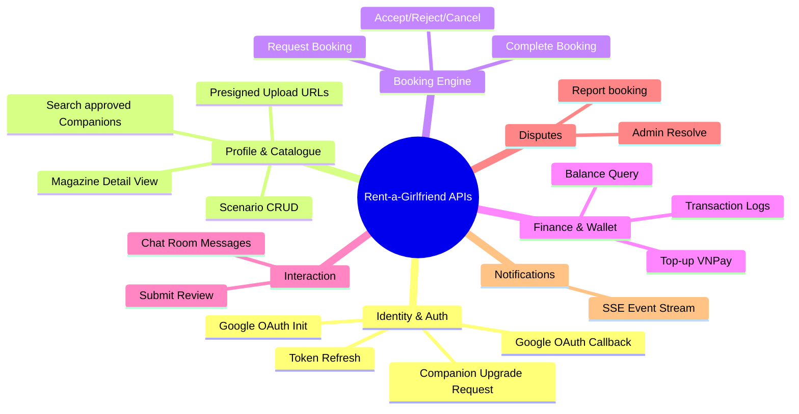

# API DRAFT SPECIFICATION (DRAFT MOCK CONTRACT)

Tài liệu này định nghĩa dự thảo các REST API endpoints của hệ thống **Rent-a-Girlfriend** dựa trên sự thống nhất về cấu trúc phản hồi và kế hoạch refactor sang **`camelCase`**. Tài liệu này đóng vai trò làm hợp đồng giao tiếp (mock contract) để đội ngũ Frontend (Mobile/Web) có thể phát triển song song với Backend.

---

## 1. QUY CHUẨN CHUNG (GENERAL STANDARDS)

*   **Base URL:** `http://localhost:8080/api/v1` (Điểm truy cập duy nhất qua API Gateway).
*   **Authentication:** Access Token được đính kèm tại Header `Authorization: Bearer <JWT_TOKEN>`.
*   **JSON Casing:** Toàn bộ các trường trong JSON payload (Request Body & Response Body) **bắt buộc sử dụng `camelCase`** (đang trong quá trình refactor đồng bộ).
*   **Tiền tệ:** `Kano-Coin` là kiểu số nguyên dương (`integer`). Tỷ lệ quy đổi cố định: `1 Kano-Coin = 1,000 VNĐ`.
*   **Định dạng phản hồi thành công (Success - Naked JSON):** Không đóng gói vỏ bọc, trả trực tiếp resource ở Root Level của JSON payload.
    *   Ví dụ:
        ```json
        {
          "bookingId": "bk_cinema_888",
          "status": "ACCEPTED"
        }
        ```
*   **Định dạng phản hồi thất bại (Error - gRPC-Gateway Default Model):** Không đóng gói vỏ bọc lỗi, trả trực tiếp các thuộc tính lỗi ở Root Level.
    *   Ví dụ:
        ```json
        {
          "code": 3,
          "message": "Thời gian bắt đầu cuộc hẹn phải lớn hơn thời gian hiện tại ít nhất 2 giờ.",
          "details": [
            {
              "field": "startTime",
              "description": "Thời gian không hợp lệ [INV-B01]"
            }
          ]
        }
        ```

---

## 2. DANH SÁCH ENDPOINTS CHI TIẾT



### 2.1. IDENTITY & AUTHENTICATION SERVICE

Dịch vụ quản lý định danh và xác thực thông qua Google OAuth.

#### [GET] `/auth/google/init`
*   **Authentication:** None (Public)
*   **Mô tả:** Khởi tạo luồng đăng nhập Google OAuth2. Trả về URL để redirect người dùng sang trang đăng nhập của Google.
*   **Response Body (Success):**
    ```json
    {
      "authUrl": "https://accounts.google.com/o/oauth2/v2/auth?client_id=..."
    }
    ```

#### [GET] `/auth/google/callback`
*   **Authentication:** None (Public)
*   **Mô tả:** Tiếp nhận Authorization Code trả về từ Google Callback để xác thực và cấp phát cặp Access Token & Refresh Token.
*   **Query Parameters:**
    *   `code`: Mã code xác thực từ Google
    *   `state`: Chuỗi kiểm tra bảo mật CSRF
*   **Response Body (Success):**
    ```json
    {
      "accessToken": "eyJhbGciOiJSUzI1NiIs...",
      "refreshToken": "ref_rot_abc123xyz...",
      "tokenType": "Bearer",
      "expiresIn": 3600
    }
    ```

#### [POST] `/auth/refresh`
*   **Authentication:** None (Public)
*   **Mô tả:** Đổi Refresh Token cũ lấy Access Token mới và Refresh Token mới (Refresh Token Rotation).
*   **Request Body:**
    ```json
    {
      "refreshToken": "ref_rot_abc123xyz..."
    }
    ```
*   **Response Body (Success):**
    ```json
    {
      "accessToken": "eyJhbGciOiJSUzI1NiIs...",
      "refreshToken": "ref_rot_new_key_456...",
      "tokenType": "Bearer",
      "expiresIn": 3600
    }
    ```

#### [POST] `/auth/logout`
*   **Authentication:** Access Token (Bearer)
*   **Mô tả:** Đăng xuất người dùng bằng cách thu hồi và vô hiệu hóa Refresh Token hiện tại.
*   **Request Body:**
    ```json
    {
      "refreshToken": "ref_rot_new_key_456..."
    }
    ```
*   **Response Body (Success):**
    ```json
    {
      "message": "Logout successful"
    }
    ```

#### [POST] `/upgrade-requests`
*   **Authentication:** Access Token (Phải có vai trò `CLIENT`)
*   **Mô tả:** Client gửi yêu cầu nâng cấp tài khoản lên thành Companion (Cung cấp thông tin giới thiệu ban đầu).
*   **Request Body:**
    ```json
    {
      "biography": "Hãy để tôi đóng vai một người bạn gái hoàn hảo...",
      "availableCities": ["HCM", "Danang"]
    }
    ```
*   **Response Body (Success):**
    ```json
    {
      "message": "Upgrade request submitted successfully. Waiting for admin approval."
    }
    ```

#### [GET] `/admin/upgrade-requests`
*   **Authentication:** Access Token (Phải là `ADMIN`)
*   **Mô tả:** Admin lấy danh sách các yêu cầu nâng cấp lên Companion đang chờ duyệt.
*   **Response Body (Success):**
    ```json
    {
      "requests": [
        {
          "requestId": "req_up_123",
          "userId": "usr_kazuya_001",
          "email": "companion.candidate@example.com",
          "biography": "Hãy để tôi đóng vai một người bạn gái hoàn hảo...",
          "availableCities": ["HCM", "Danang"],
          "status": "PENDING"
        }
      ]
    }
    ```

#### [PUT] `/admin/upgrade-requests/{id}/approve`
*   **Authentication:** Access Token (Phải là `ADMIN`)
*   **Mô tả:** Admin duyệt yêu cầu nâng cấp, kích hoạt role `COMPANION` cho người dùng.
*   **Response Body (Success):**
    ```json
    {
      "message": "Upgrade request approved. User role updated to COMPANION."
    }
    ```

#### [PUT] `/admin/upgrade-requests/{id}/reject`
*   **Authentication:** Access Token (Phải là `ADMIN`)
*   **Mô tả:** Admin từ chối yêu cầu nâng cấp của tài khoản.
*   **Request Body:**
    ```json
    {
      "reason": "Mô tả lý do từ chối (ảnh đại diện chưa phù hợp, thông tin thiếu...)"
    }
    ```
*   **Response Body (Success):**
    ```json
    {
      "message": "Upgrade request rejected successfully."
    }
    ```

#### [GET] `/admin/accounts/{id}`
*   **Authentication:** Access Token (Phải là `ADMIN`)
*   **Mô tả:** Admin lấy thông tin chi tiết một tài khoản bất kỳ.
*   **Response Body (Success):**
    ```json
    {
      "userId": "550e8400-e29b-41d4-a716-446655440000",
      "email": "user@example.com",
      "role": "COMPANION",
      "status": "ACTIVE",
      "violationCount": 0
    }
    ```

#### [PUT] `/admin/accounts/{id}/lock`
*   **Authentication:** Access Token (Phải là `ADMIN`)
*   **Mô tả:** Admin thực hiện khóa tài khoản người dùng vi phạm quy chế cộng đồng.
*   **Request Body:**
    ```json
    {
      "reason": "Hành vi gian lận thanh toán hoặc vi phạm quy định hủy hẹn."
    }
    ```
*   **Response Body (Success):**
    ```json
    {
      "message": "Account locked successfully."
    }
    ```

#### [PUT] `/admin/accounts/{id}/unlock`
*   **Authentication:** Access Token (Phải là `ADMIN`)
*   **Mô tả:** Admin mở khóa cho tài khoản bị phạt.
*   **Response Body (Success):**
    ```json
    {
      "message": "Account unlocked successfully."
    }
    ```

---

### 2.2. PROFILE & CATALOGUE SERVICE

Dịch vụ quản lý thông tin Companion, danh mục dịch vụ (Scenarios) và hình ảnh/âm thanh giới thiệu.

#### [GET] `/companions`
*   **Authentication:** None (Public)
*   **Mô tả:** Client tìm kiếm và lọc danh sách Companion đã được duyệt (`status == APPROVED`).
*   **Query Parameters:**
    *   `name`: Lọc theo tên (partial match)
    *   `city`: Thành phố hoạt động (ví dụ: `Hanoi`, `HCM`, `Danang`)
    *   `minPrice` / `maxPrice`: Khoảng giá kịch bản
    *   `page` / `pageSize`: Phân trang và giới hạn bản ghi
*   **Response Body (Success):**
    ```json
    {
      "companions": [
        {
          "companionId": "cmp_chizuru_123",
          "displayName": "Chizuru Ichinose",
          "avatarUrl": "https://storage.rent-a-gf.com/avatars/chizuru.png",
          "averageRating": 4.9,
          "totalReviews": 128,
          "availableCities": ["HCM", "Danang"],
          "minPrice": 300,
          "voiceIntroUrl": "https://storage.rent-a-gf.com/voice/chizuru.mp3"
        }
      ],
      "total": 45,
      "page": 1,
      "pageSize": 10
    }
    ```

#### [GET] `/companions/{companionId}`
*   **Authentication:** None (Public)
*   **Mô tả:** Xem chi tiết hồ sơ Companion dạng Magazine View (Thông tin cá nhân, Album ảnh, Voice Intro, các Scenario hoạt động).
*   **Response Body (Success):**
    ```json
    {
      "companionId": "cmp_chizuru_123",
      "displayName": "Chizuru Ichinose",
      "biography": "Hãy để tôi đóng vai một người bạn gái hoàn hảo trong buổi hẹn hò của bạn.",
      "avatarUrl": "https://storage.rent-a-gf.com/avatars/chizuru.png",
      "albumUrls": [
        "https://storage.rent-a-gf.com/albums/chizuru_1.png",
        "https://storage.rent-a-gf.com/albums/chizuru_2.png"
      ],
      "voiceIntroUrl": "https://storage.rent-a-gf.com/voice/chizuru.mp3",
      "availableCities": ["HCM", "Danang"],
      "averageRating": 4.9,
      "totalReviews": 128,
      "scenarios": [
        {
          "scenarioId": "scn_cinema_01",
          "title": "Hẹn hò xem phim lãng mạn",
          "description": "Cùng đi xem phim, chia sẻ bắp rang bơ...",
          "price": 300,
          "durationMinutes": 120,
          "publicPlace": "CGV Vincom Landmark 81"
        }
      ]
    }
    ```

#### [GET] `/profile/me`
*   **Authentication:** Access Token (Phải là `COMPANION`)
*   **Mô tả:** Companion lấy hồ sơ và trạng thái tài khoản của chính mình.
*   **Response Body (Success):**
    ```json
    {
      "companionId": "cmp_chizuru_123",
      "displayName": "Chizuru Ichinose",
      "biography": "Hãy để tôi đóng vai một người bạn gái...",
      "avatarUrl": "https://storage.rent-a-gf.com/avatars/chizuru.png",
      "albumUrls": [],
      "voiceIntroUrl": "https://storage.rent-a-gf.com/voice/chizuru.mp3",
      "availableCities": ["HCM", "Danang"],
      "status": "APPROVED"
    }
    ```

#### [POST] `/profile/me/media/presigned-urls`
*   **Authentication:** Access Token (Phải là `COMPANION`)
*   **Mô tả:** Sinh link Presigned URL để upload file (Ảnh chân dung/Album hoặc file ghi âm Voice Intro) trực tiếp lên Cloud Storage.
*   **Request Body:**
    ```json
    {
      "assetType": "VOICE",
      "sizeBytes": 3200000,
      "durationSeconds": 24,
      "contentType": "audio/mp3"
    }
    ```
    *Ràng buộc:*
    *   Ảnh tối đa 2MB (IMAGE) (`[INV-P05]`), âm thanh tối đa 5MB và không dài quá 30 giây (VOICE) (`[INV-P04]`).
*   **Response Body (Success):**
    ```json
    {
      "uploadUrl": "https://storage.rent-a-gf.com/voice/chizuru.mp3?X-Amz-Signature=...",
      "fileUrl": "https://storage.rent-a-gf.com/voice/chizuru.mp3"
    }
    ```

#### [POST] `/profile/me/scenarios`
*   **Authentication:** Access Token (Phải là `COMPANION`)
*   **Mô tả:** Companion tạo kịch bản dịch vụ mới.
*   **Request Body:**
    ```json
    {
      "title": "Hẹn hò rạp chiếu phim",
      "description": "Cùng đi xem phim và đi dạo trò chuyện...",
      "price": 300,
      "durationMinutes": 120,
      "publicPlace": "CGV Landmark 81"
    }
    ```
    *Ràng buộc: Price > 0 (INV-P01), durationMinutes thuộc mốc [60, 120, 180] (INV-P02), số lượng kịch bản tối đa 5 (INV-P03).*
*   **Response Body (Success):**
    ```json
    {
      "scenarioId": "scn_cinema_01",
      "message": "Scenario created successfully",
      "status": "SUCCESS"
    }
    ```

#### [PUT] `/profile/me/scenarios/{scenarioId}`
*   **Authentication:** Access Token (Phải là `COMPANION`)
*   **Mô tả:** Cập nhật thông tin chi tiết của kịch bản hiện tại.
*   **Request Body:**
    ```json
    {
      "title": "Hẹn hò rạp chiếu phim v2",
      "description": "Cập nhật mô tả kịch bản...",
      "price": 350,
      "durationMinutes": 120,
      "publicPlace": "Lotte Cinema Cantavil"
    }
    ```
*   **Response Body (Success):**
    ```json
    {
      "scenarioId": "scn_cinema_01",
      "message": "Scenario updated successfully",
      "status": "SUCCESS"
    }
    ```

#### [DELETE] `/profile/me/scenarios/{scenarioId}`
*   **Authentication:** Access Token (Phải là `COMPANION`)
*   **Mô tả:** Ẩn hoặc xóa kịch bản của Companion.
*   **Response Body (Success):**
    ```json
    {
      "scenarioId": "scn_cinema_01",
      "message": "Scenario deleted successfully",
      "status": "SUCCESS"
    }
    ```

---

### 2.3. BOOKING SERVICE

Dịch vụ lõi xử lý toàn bộ vòng đời cuộc hẹn và thực thi các kiểm tra ràng buộc thời gian.

#### [POST] `/bookings`
*   **Authentication:** Access Token (Phải là `CLIENT`)
*   **Mô tả:** Khởi tạo yêu cầu đặt lịch hẹn. Hệ thống sẽ gọi gRPC nội bộ sang Finance để đóng băng tiền (`FreezeCoin`).
*   **Request Body:**
    ```json
    {
      "companionId": "cmp_chizuru_123",
      "scenarioId": "scn_cinema_01",
      "startTime": "2026-06-20T19:00:00Z"
    }
    ```
    *Ràng buộc:*
    *   `startTime` phải cách giờ đặt lịch tối thiểu **2 giờ** (MinAdvanceBookingHours = 2) `[INV-B01]`.
    *   Client không được có 2 cuộc hẹn chồng chéo (overlap) `[INV-B06]`.
*   **Response Body (Success):**
    ```json
    {
      "bookingId": "bk_cinema_888",
      "clientId": "cli_kazuya_001",
      "companionId": "cmp_chizuru_123",
      "scenarioSnapshot": {
        "title": "Hẹn hò xem phim lãng mạn",
        "price": 300,
        "durationMinutes": 120,
        "publicPlace": "CGV Vincom Landmark 81"
      },
      "startTime": "2026-06-20T19:00:00Z",
      "endTime": "2026-06-20T21:00:00Z",
      "status": "PENDING"
    }
    ```

#### [GET] `/bookings`
*   **Authentication:** Access Token (Client hoặc Companion tham gia cuộc hẹn)
*   **Mô tả:** Lấy danh sách lịch sử cuộc hẹn của bản thân.
*   **Query Parameters:**
    *   `status`: Lọc theo trạng thái (`PENDING`, `ACCEPTED`, `COMPLETED`, `CANCELLED`, `DISPUTED`)
    *   `page` / `pageSize`: Phân trang
*   **Response Body (Success):**
    ```json
    {
      "bookings": [
        {
          "bookingId": "bk_cinema_888",
          "partnerName": "Chizuru Ichinose",
          "partnerAvatar": "https://storage.rent-a-gf.com/avatars/chizuru.png",
          "scenarioTitle": "Hẹn hò xem phim lãng mạn",
          "price": 300,
          "startTime": "2026-06-20T19:00:00Z",
          "chatRoomId": "chat_room_888",
          "hasReviewed": false,
          "status": "ACCEPTED"
        }
      ],
      "total": 1,
      "page": 1,
      "pageSize": 10
    }
    ```

#### [GET] `/bookings/{bookingId}`
*   **Authentication:** Access Token (Đối tác tham gia cuộc hẹn)
*   **Mô tả:** Lấy thông tin chi tiết trạng thái của cuộc hẹn và ID phòng chat.
*   **Response Body (Success):**
    ```json
    {
      "bookingId": "bk_cinema_888",
      "clientId": "cli_kazuya_001",
      "companionId": "cmp_chizuru_123",
      "scenarioSnapshot": {
        "title": "Hẹn hò xem phim lãng mạn",
        "price": 300,
        "durationMinutes": 120,
        "publicPlace": "CGV Vincom Landmark 81"
      },
      "startTime": "2026-06-20T19:00:00Z",
      "endTime": "2026-06-20T21:00:00Z",
      "status": "ACCEPTED",
      "chatRoomId": "chat_room_888",
      "chatRoomStatus": "ACTIVE",
      "hasReviewed": false
    }
    ```

#### [PUT] `/bookings/{bookingId}/accept`
*   **Authentication:** Access Token (Phải là `COMPANION` được đặt lịch)
*   **Mô tả:** Đồng ý nhận cuộc hẹn. Tiền đặt cọc được ký quỹ (`Escrow`) và kích hoạt phòng chat.
*   **Response Body (Success):**
    ```json
    {
      "bookingId": "bk_cinema_888",
      "status": "ACCEPTED",
      "chatRoomId": "chat_room_888"
    }
    ```
    *Ràng buộc:*
    *   Hành động accept phải diễn ra trong vòng 12h kể từ lúc tạo và cách `startTime` ít nhất 1h.
    *   Companion không được accept các booking bị trùng thời gian hoạt động `[INV-B07]`.

#### [PUT] `/bookings/{bookingId}/reject`
*   **Authentication:** Access Token (Phải là `COMPANION` được đặt lịch)
*   **Mô tả:** Từ chối cuộc hẹn. Hệ thống tự động giải phóng cọc (`Unfreeze`) trả lại ví Client.
*   **Response Body (Success):**
    ```json
    {
      "bookingId": "bk_cinema_888",
      "status": "REJECTED"
    }
    ```

#### [PUT] `/bookings/{bookingId}/cancel`
*   **Authentication:** Access Token (Đối tác trong cuộc hẹn)
*   **Mô tả:** Hủy cuộc hẹn đã chấp nhận.
*   **Quy tắc hoàn tiền và phạt vi phạm:**
    *   **Hủy sớm (> 24 giờ so với giờ hẹn):** Hoàn cọc 100% về ví Client (BR-05/BR-07).
    *   **Hủy muộn (<= 24 giờ):**
        *   Nếu Client hủy muộn / No-show: Client mất 100% tiền cọc chuyển sang ví đền bù cho Companion (BR-06).
        *   Nếu Companion hủy muộn: Client được hoàn 100% tiền. Companion bị ghi nhận **1 lần vi phạm** (BR-07a).
*   **Response Body (Success):**
    ```json
    {
      "bookingId": "bk_cinema_888",
      "status": "CANCELLED",
      "refundAmount": 300,
      "compensationAmount": 0
    }
    ```

#### [PUT] `/bookings/{bookingId}/complete`
*   **Authentication:** None (Thường chạy tự động bởi hệ thống)
*   **Mô tả:** Đánh dấu hoàn thành cuộc hẹn (tự động chạy sau `endTime` + 12 giờ).
*   **Response Body (Success):**
    ```json
    {
      "bookingId": "bk_cinema_888",
      "status": "COMPLETED"
    }
    ```

---

### 2.4. FINANCE & WALLET SERVICE

Dịch vụ quản lý số dư, xử lý nạp tiền (Top-up) tích hợp cổng thanh toán VNPay Sandbox.

#### [GET] `/finance/wallet`
*   **Authentication:** Access Token (Bearer)
*   **Mô tả:** Lấy thông tin số dư ví hiện tại của người dùng.
*   **Query Parameters:**
    *   `userId`: Định danh người dùng truy vấn số dư
*   **Response Body (Success):**
    ```json
    {
      "walletId": "wall_kazuya_001",
      "userId": "550e8400-e29b-41d4-a716-446655440000",
      "availableBalance": 520,
      "frozenBalance": 300
    }
    ```

#### [POST] `/finance/topup`
*   **Authentication:** Access Token (Phải là `CLIENT`)
*   **Mô tả:** Tạo đơn nạp tiền bằng ví nội bộ. Hệ thống sẽ tính tỉ lệ quy đổi và trả về link redirect sang cổng VNPay.
*   **Request Body:**
    ```json
    {
      "userId": "550e8400-e29b-41d4-a716-446655440000",
      "amount": 500
    }
    ```
*   **Response Body (Success):**
    ```json
    {
      "paymentUrl": "https://sandbox.vnpayment.vn/paymentv2/vpcpay.html?vnp_Amount=50000000&..."
    }
    ```

#### [GET] `/finance/vnpay-ipn`
*   **Authentication:** None (Webhook từ VNPay)
*   **Mô tả:** Webhook nhận kết quả thanh toán từ VNPay. Thực thi đối soát chữ ký bảo mật và cập nhật số dư ví thực tế.
*   **Response Body (Success):**
    ```json
    {
      "RspCode": "00",
      "Message": "Confirm success"
    }
    ```

#### [GET] `/finance/vnpay-return`
*   **Authentication:** None (Redirect từ trình duyệt)
*   **Mô tả:** Trang kết quả thanh toán trả về HTML cao cấp hiển thị cho người dùng sau khi thanh toán ở VNPay.
*   **Response Body (Success):**
    *   *Trả về HTML trực tiếp (HTTP 200 OK)*

---

### 2.5. INTERACTION & CHAT ROOM SERVICE

Dịch vụ quản lý phòng chat trực tiếp và hệ thống thu thập đánh giá sao của Client.

#### [GET] `/interaction/rooms/{roomId}/messages`
*   **Authentication:** Access Token (Tham gia cuộc hẹn)
*   **Mô tả:** Lấy lịch sử tin nhắn của phòng chat.
*   **Query Parameters:**
    *   `limit`: Giới hạn số lượng tin nhắn (mặc định 50)
    *   `offset`: Phân trang bỏ qua bản ghi
*   **Response Body (Success):**
    ```json
    [
      {
        "messageId": "msg_001",
        "roomId": "chat_room_888",
        "senderId": "cli_kazuya_001",
        "content": "Chào bạn, mình hẹn gặp nhau đúng giờ nhé!",
        "createdAt": "2026-06-18T11:00:00Z"
      }
    ]
    ```

#### [POST] `/interaction/rooms/{roomId}/messages`
*   **Authentication:** Access Token (Tham gia cuộc hẹn)
*   **Mô tả:** Gửi tin nhắn vào phòng chat (chỉ khả dụng khi chat room ở trạng thái `ACTIVE`).
*   **Request Body:**
    ```json
    {
      "text": "Ok bạn, mình sẽ đến đúng giờ."
    }
    ```
*   **Response Body (Success):**
    ```json
    {
      "messageId": "msg_002",
      "roomId": "chat_room_888",
      "senderId": "cmp_chizuru_123",
      "content": "Ok bạn, mình sẽ đến đúng giờ.",
      "createdAt": "2026-06-18T11:02:00Z"
    }
    ```

#### [POST] `/interaction/reviews`
*   **Authentication:** Access Token (Phải là `CLIENT` của booking tương ứng)
*   **Mô tả:** Client gửi đánh giá sao và comment sau cuộc hẹn.
*   **Request Body:**
    ```json
    {
      "bookingId": "bk_cinema_888",
      "rating": 5,
      "comment": "Dịch vụ rất tuyệt vời!"
    }
    ```
    *Ràng buộc:*
    *   Rating nằm trong khoảng [1, 5] (`[INV-I05]`).
    *   Mỗi cuộc hẹn chỉ có thể đánh giá duy nhất **1 lần**, không thể chỉnh sửa hay xóa (`[INV-I04]`, `BR-09`, `BR-10`).
    *   Thời gian gửi review phải lớn hơn hoặc bằng `endTime` của cuộc hẹn (BR-08).
*   **Response Body (Success):**
    ```json
    {
      "reviewId": "rev_777",
      "message": "Review submitted successfully."
    }
    ```

#### [GET] `/interaction/reviews/companion/{companionId}`
*   **Authentication:** None (Public)
*   **Mô tả:** Xem danh sách review của Companion.
*   **Response Body (Success):**
    ```json
    [
      {
        "reviewId": "rev_777",
        "bookingId": "bk_cinema_888",
        "clientId": "cli_kazuya_001",
        "companionId": "cmp_chizuru_123",
        "rating": 5,
        "comment": "Dịch vụ rất tuyệt vời!",
        "createdAt": "2026-06-20T21:30:00Z",
        "updatedAt": "2026-06-20T21:30:00Z"
      }
    ]
    ```

---

### 2.6. DISPUTE & REPORT SERVICE

Dịch vụ khiếu nại chất lượng và phân xử dòng tiền cọc của Admin.

#### [POST] `/disputes`
*   **Authentication:** Access Token (Người tham gia cuộc hẹn)
*   **Mô tả:** Khởi tạo khiếu nại (báo cáo vi phạm, No-show). Hệ thống lập tức đóng băng Escrow để tránh tự động Payout.
*   **Request Body:**
    ```json
    {
      "bookingId": "bk_cinema_888",
      "reason": "NO_SHOW",
      "description": "Companion không đến địa điểm CGV Landmark 81 sau 30 phút."
    }
    ```
*   **Response Body (Success):**
    ```json
    {
      "disputeId": "dis_abc999",
      "message": "Dispute reported. Funds frozen. Waiting for admin resolution.",
      "status": "OPEN"
    }
    ```

#### [GET] `/disputes`
*   **Authentication:** Access Token (Phải là `ADMIN`)
*   **Mô tả:** Admin lấy danh sách các vụ tranh chấp/khiếu nại chưa xử lý.
*   **Query Parameters:**
    *   `status`: Lọc theo trạng thái khiếu nại (`OPEN`, `RESOLVING`, `RESOLVED`)
    *   `page` / `pageSize`: Phân trang
*   **Response Body (Success):**
    ```json
    {
      "disputes": [
        {
          "disputeId": "dis_abc999",
          "bookingId": "bk_cinema_888",
          "reporterId": "cli_kazuya_001",
          "accusedId": "cmp_chizuru_123",
          "reason": "NO_SHOW",
          "status": "OPEN",
          "version": 1,
          "evidences": []
        }
      ],
      "total": 1,
      "page": 1,
      "pageSize": 10
    }
    ```

#### [GET] `/disputes/{disputeId}`
*   **Authentication:** Access Token (Phải là `ADMIN`)
*   **Mô tả:** Chi tiết thông tin và bằng chứng của một vụ tranh chấp.
*   **Response Body (Success):**
    ```json
    {
      "disputeId": "dis_abc999",
      "bookingId": "bk_cinema_888",
      "reporterId": "cli_kazuya_001",
      "accusedId": "cmp_chizuru_123",
      "reason": "NO_SHOW",
      "status": "OPEN",
      "adminId": null,
      "resolution": null,
      "notes": null,
      "version": 1,
      "evidences": [
        {
          "evidenceId": "ev_001",
          "evidenceType": "IMAGE",
          "content": "https://storage.rent-a-gf.com/evidence/no_show_proof.png"
        }
      ]
    }
    ```

#### [POST] `/disputes/{disputeId}/resolve`
*   **Authentication:** Access Token (Phải là `ADMIN`)
*   **Mô tả:** Admin giải quyết khiếu nại và ra phán quyết xử lý dòng tiền (Refund hoặc Payout).
*   **Request Body:**
    ```json
    {
      "resolution": "REFUND_CLIENT",
      "notes": "Companion xác nhận no-show, hoàn trả cọc 100% cho Client."
    }
    ```
    *Các giá trị `resolution` hợp lệ: `REFUND_CLIENT`, `PAYOUT_COMPANION`, `REJECT_DISPUTE`.*
*   **Response Body (Success):**
    ```json
    {
      "disputeId": "dis_abc999",
      "status": "RESOLVED",
      "resolution": "REFUND_CLIENT"
    }
    ```

---

### 2.7. REALTIME NOTIFICATIONS (SSE)

Dịch vụ thông báo thời gian thực sử dụng Server-Sent Events (SSE).

#### [GET] `/notifications/stream`
*   **Authentication:** Access Token (Bearer)
*   **Mô tả:** Client/Companion đăng ký kênh SSE nhận thông báo thời gian thực từ hệ thống.
*   **Response Headers:**
    *   `Content-Type: text/event-stream`
    *   `Cache-Control: no-cache`
    *   `Connection: keep-alive`
*   **Event Output (SSE Data Chunks):**
    *   *Thông báo BookingRequested (Đến Companion):*
        ```
        event: notification
        data: {"id":"nt_1","type":"BOOKING_REQUESTED","title":"Yêu cầu đặt lịch mới","body":"Bạn có yêu cầu hẹn hò xem phim mới từ Kazuya.","bookingId":"bk_cinema_888"}
        ```
    *   *Thông báo BookingAccepted (Đến Client):*
        ```
        event: notification
        data: {"id":"nt_2","type":"BOOKING_ACCEPTED","title":"Chấp nhận lịch hẹn","body":"Chizuru đã đồng ý cuộc hẹn của bạn! Phòng chat hiện đã mở.","bookingId":"bk_cinema_888"}
        ```
