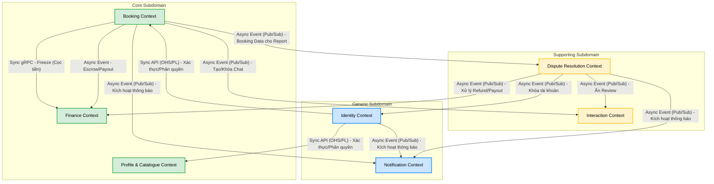

# BOUNDED CONTEXTS (NGỮ CẢNH GIỚI HẠN)

Tài liệu này định nghĩa chi tiết các **Bounded Context** của nền tảng Rent-a-Girlfriend, được tổng hợp dựa trên quá trình *Big Picture Event Storming* và phân loại *Subdomain*.

Mỗi Bounded Context đóng vai trò như một ranh giới kiến trúc độc lập, sở hữu dữ liệu (Aggregates), luồng nghiệp vụ (Policies) và vòng đời sự kiện (Domain Events) riêng biệt.

---

## Bounded Context Diagram & Context Map

Sơ đồ dưới đây mô tả mối quan hệ (Upstream/Downstream) và luồng giao tiếp giữa các Bounded Context thông qua Domain Events hoặc API/Data cung cấp:

---

## 1. Booking Context
*   **Phân loại Subdomain:** Core Subdomain
*   **Trách nhiệm:** "Trái tim" nghiệp vụ của nền tảng. Điều phối toàn bộ vòng đời (State Machine) của một lịch hẹn: từ lúc yêu cầu, chờ duyệt, chấp nhận, hủy, cho đến khi hoàn thành.
*   **Ubiquitous Language:** Từ "Booking" trong context này mang ý nghĩa là một cỗ máy trạng thái (State Machine) điều phối toàn bộ vòng đời của lịch hẹn thực tế (ai gặp ai, giờ nào, ở đâu).
*   **Aggregates chính:**
    *   `Booking`: Entity trung tâm quản lý trạng thái cuộc hẹn, lịch trình, và thông tin giá cả.
*   **Domain Events chính:**
    *   *Yêu cầu đặt lịch đã được gửi / chấp nhận / bị từ chối / hết hạn.*
    *   *Lịch hẹn bị hủy sớm/muộn bởi Client/Companion.*
    *   *Cuộc hẹn đã được tự động hoàn thành.*
*   **Tương tác & Chính sách (Policies):**
    *   Chỉ đạo **Finance Context** thực hiện việc giữ tiền (Freeze/Escrow) và thanh toán thông qua Domain Events.
    *   Chỉ đạo **Interaction Context** mở hoặc khóa phòng chat dựa theo trạng thái cuộc hẹn.
    *   Kiểm soát các quy tắc tự động hóa: Timeout quá hạn duyệt, Tự động hoàn thành sau khi kết thúc.

## 2. Profile & Catalogue Context
*   **Phân loại Subdomain:** Core Subdomain
*   **Trách nhiệm:** Nơi Companion xây dựng và quản lý thương hiệu cá nhân để thu hút Client. Quản lý danh mục dịch vụ (Scenario) và các tài sản truyền thông (Media).
*   **Aggregates chính:**
    *   `CompanionProfile`: Thông tin cá nhân, thành phố, định danh.
    *   `MediaAsset`: Album ảnh, Voice Intro.
    *   `Scenario`: Kịch bản dịch vụ (tên, mô tả, mức giá, địa điểm).
*   **Domain Events chính:**
    *   *Profile Companion đã được cập nhật.*
    *   *Voice Intro đã được tải lên / bị từ chối.*
    *   *Kịch bản dịch vụ (Scenario) đã được tạo/cập nhật.*
*   **Tương tác & Chính sách (Policies):**
    *   Kiểm duyệt tính hợp lệ của Voice Intro tự động.
    *   Cung cấp dữ liệu qua **Sync API** (Snapshot của Scenario) cho **Booking Context** khi Client tiến hành đặt lịch để đảm bảo tính bất biến của giá cả và dịch vụ lúc đặt.

## 3. Identity Context
*   **Phân loại Subdomain:** Generic Subdomain
*   **Trách nhiệm:** Xử lý xác thực người dùng, định danh tài khoản, phân quyền (Client/Companion/Admin) và quản lý trạng thái đóng/mở tài khoản. Xử lý quy trình xét duyệt Onboarding.
*   **Aggregates chính:**
    *   `UserAccount`: Quản lý thông tin đăng nhập, vai trò, trạng thái tài khoản (Active/Locked), và bộ đếm vi phạm.
*   **Domain Events chính:**
    *   *User đã đăng nhập lần đầu.*
    *   *Yêu cầu nâng cấp Companion đã được gửi / duyệt / từ chối.*
    *   *Tài khoản đã bị khóa / mở khóa.*
*   **Tương tác & Chính sách (Policies):**
    *   Tích hợp bên ngoài với **Google OAuth**.
    *   Lắng nghe tín hiệu từ **Dispute Resolution Context** thông qua **Async Event** để tiến hành khóa tài khoản nếu Companion đạt ngưỡng vi phạm tối đa.

## 4. Finance Context
*   **Phân loại Subdomain:** Core Subdomain
*   **Trách nhiệm:** Quản lý toàn bộ hệ sinh thái tài chính ảo (Kano-Coin). Chịu trách nhiệm trực tiếp cho thao tác tính toán số dư, nạp tiền, giữ tiền đặt cọc (Escrow) và chia sẻ hoa hồng. Cốt lõi của mô hình kinh doanh nền tảng.
*   **Ubiquitous Language:** Từ "Booking" trong context này chỉ mang ý nghĩa là một "lý do" hoặc "mã tham chiếu" để giải thích việc tại sao tiền bị đóng băng (Freeze/Escrow) hay giải ngân (Payout). Nó hoàn toàn không chứa thông tin về cuộc hẹn.
*   **Aggregates chính:**
    *   `Wallet`: Số dư Kano-Coin khả dụng.
    *   `Transaction`: Lịch sử các giao dịch biến động số dư.
    *   `Escrow`: Khối lượng coin bị đóng băng tương ứng với từng booking.
*   **Domain Events chính:**
    *   *Nạp tiền Kano-Coin thành công / thất bại.*
    *   *Coin đã bị Freeze / bị từ chối Freeze.*
    *   *Coin đã được chuyển vào Escrow / Unfreeze.*
    *   *Hoa hồng nền tảng đã được thu / Thanh toán cho Companion đã được thực hiện.*
*   **Tương tác & Chính sách (Policies):**
    *   Tích hợp cổng thanh toán **VNPay** qua IPN.
    *   Hoàn toàn thụ động, chỉ phản ứng dựa trên các **Async Event (Pub/Sub)** sinh ra từ **Booking Context** hoặc quyết định của Admin từ **Dispute Resolution Context**.

## 5. Interaction Context
*   **Phân loại Subdomain:** Supporting Subdomain
*   **Trách nhiệm:** Cung cấp môi trường giao tiếp an toàn (Phòng chat) và hệ thống ghi nhận chất lượng dịch vụ (Đánh giá) sau khi có kết nối giữa hai bên.
*   **Aggregates chính:**
    *   `ChatRoom`: Phòng chat gắn kết theo từng Booking.
    *   `Review`: Đánh giá 1 chiều (Sao & Comment) từ Client dành cho Companion.
*   **Domain Events chính:**
    *   *Phòng chat đã được tạo / bị khóa.*
    *   *Đánh giá đã được gửi / bị ẩn.*
*   **Tương tác & Chính sách (Policies):**
    *   Chỉ tạo/khóa Chat khi nhận tín hiệu thay đổi trạng thái từ **Booking Context** hoặc có khiếu nại từ **Dispute Resolution Context**.
    *   Kiểm soát quy tắc đánh giá 1 lần duy nhất, không chỉnh sửa. Ẩn Review nếu Admin phán quyết Refund cho Client.

## 6. Dispute Resolution Context
*   **Phân loại Subdomain:** Supporting Subdomain
*   **Trách nhiệm:** Bộ máy giải quyết xung đột (Khiếu nại/Report) của nền tảng, đảm bảo tính công bằng và thu thập ghi nhận vi phạm để duy trì chất lượng hệ thống.
*   **Aggregates chính:**
    *   `Dispute`: Quản lý tiến trình xử lý khiếu nại và quyết định cuối cùng của Admin.
*   **Domain Events chính:**
    *   *Khiếu nại đã được tạo.*
    *   *Khiếu nại đã được giải quyết (Refund / Payout).*
    *   *Vi phạm của Companion đã được ghi nhận / đạt ngưỡng.*
*   **Tương tác & Chính sách (Policies):**
    *   Cung cấp các phán quyết cuối cùng để **Finance Context** xuất tiền (Refund/Payout), **Interaction Context** (ẩn Review/khóa Chat), và **Identity Context** (cộng vi phạm/khóa tài khoản).

## 7. Notification Context
*   **Phân loại Subdomain:** Generic Subdomain
*   **Trách nhiệm:** Quản lý tập trung hạ tầng phân phối thông báo đa kênh (SSE, FCM, Email). Tách rời mối bận tâm về hệ thống thông báo (cross-cutting concern) khỏi các context nghiệp vụ, tránh biến hệ thống thành "distributed big ball of mud" nếu mỗi context tự gửi thông báo.
*   **Aggregates chính:**
    *   `Notification`: Entity quản lý nội dung, ID người nhận, kênh phân phối ưu tiên và trạng thái gửi.
    *   `NotificationTemplate`: Template nội dung cho từng loại thông báo.
*   **Domain Events chính:**
    *   *Thông báo đã được gửi / gửi thất bại.*
*   **Tương tác & Chính sách (Policies):**
    *   Lắng nghe (Subscribe) các Domain Events từ **Booking Context** (đặt lịch, hủy), **Identity Context** (khóa tài khoản) và **Dispute Resolution Context** để kích hoạt tiến trình gửi thông báo tương ứng.
    *   Xử lý chiến lược fallback giữa các kênh (ví dụ: gửi SSE trước, nếu Client offline thì fallback gửi qua FCM hoặc Email).
