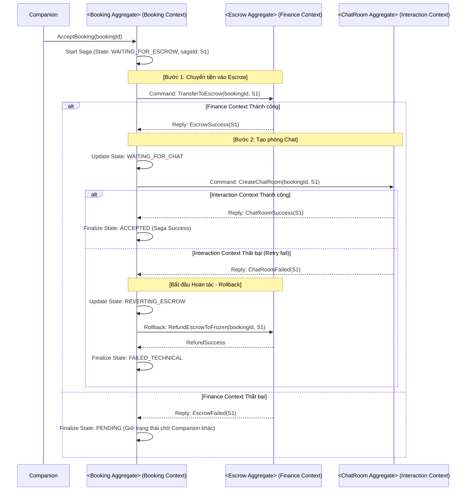
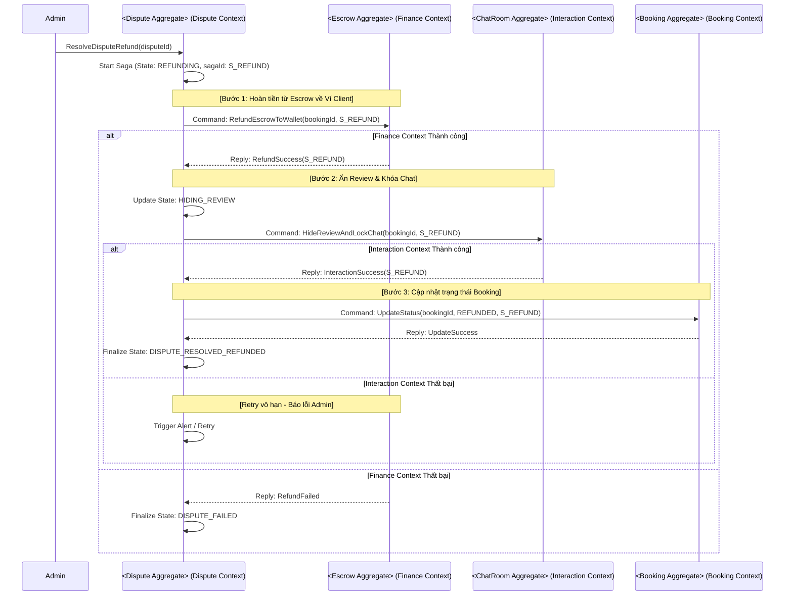
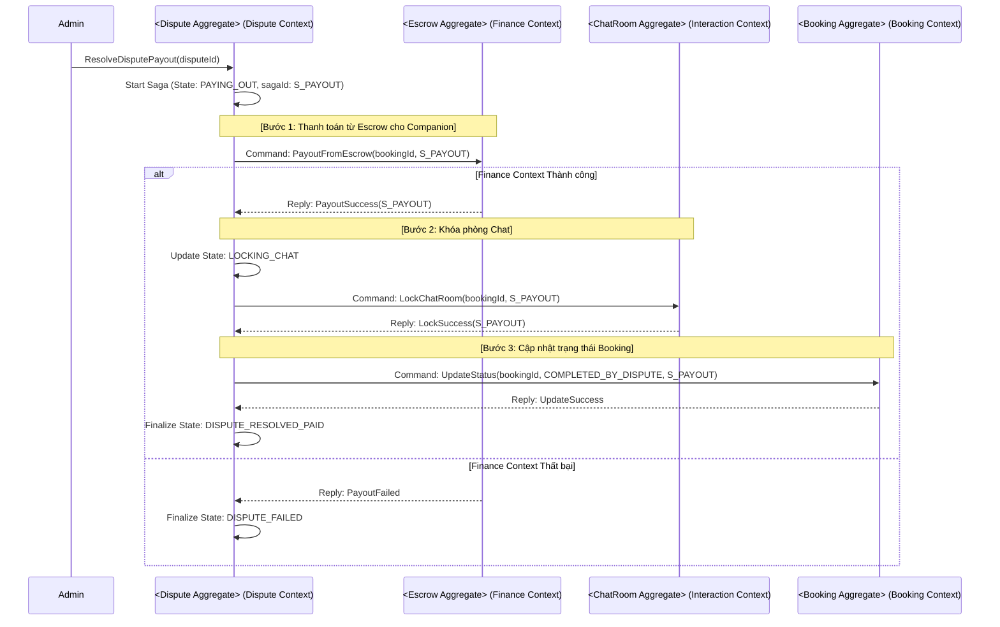
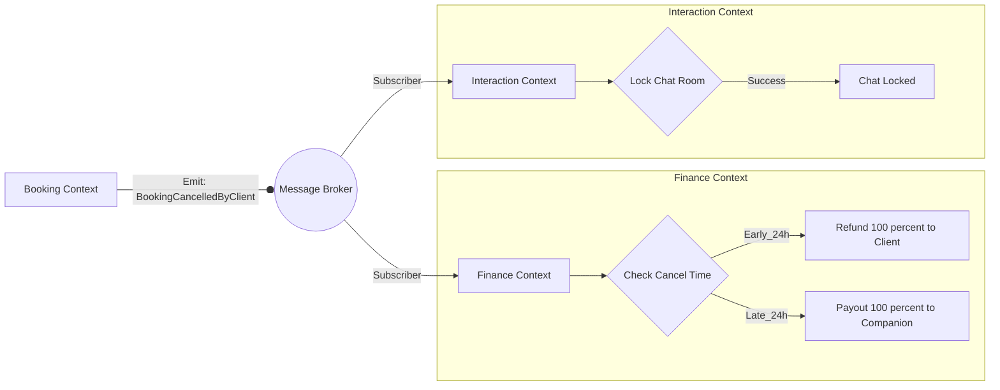
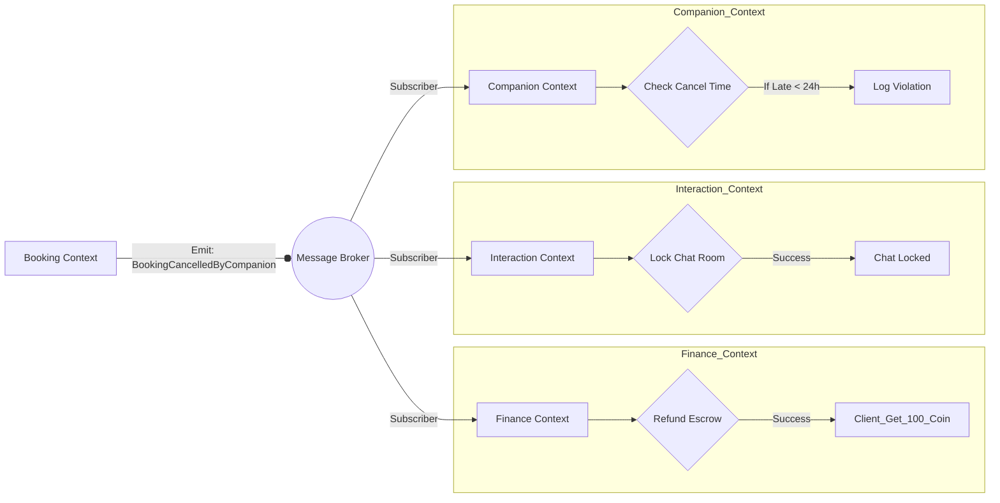
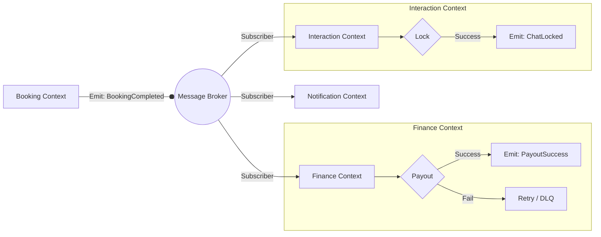

# CHI TIẾT TRIỂN KHAI SAGA - RENT-A-GIRLFRIEND SYSTEM

Tài liệu này chi tiết hóa cách áp dụng SAGA vào các luồng nghiệp vụ cốt lõi, kết hợp các giải pháp chống lỗi (Reliability) đã thiết kế trong `5-saga_design.md`.

---

## 1. LUỒNG 1: BOOKING CREATION (COMPANION ACCEPT)
*   **Mô hình:** **SAGA Orchestration** (Điều phối trung tâm).
*   **Orchestrator:** `<Booking Aggregate>` (Booking Context).
*   **Lý do:** Yêu cầu tính nhất quán cao giữa Tiền (`<Escrow>`) và Quyền lợi (`<ChatRoom>`). Nếu tiền không vào quỹ đảm bảo thành công, tuyệt đối không được mở chat.

### 1.1. Sơ đồ luồng tổng hợp (Orchestration)

### 1.2. Giải pháp kỹ thuật áp dụng cho mọi tình huống lỗi
Dưới đây là các giải pháp cụ thể cho từng tình huống lỗi có thể xảy ra trong luồng Orchestration:

| Tình huống lỗi | Giải pháp kỹ thuật | Chi tiết áp dụng vào luồng |
| :--- | :--- | :--- |
| **Mất tin nhắn (Lost Message)** | **Transactional Outbox Pattern** | **Booking Context** lưu lệnh gửi vào bảng Outbox cùng transaction với log trạng thái. Nếu không nhận được xác nhận từ Broker, một tiến trình ngầm sẽ gửi lại lệnh cho đến khi **Finance Context** nhận được. |
| **Trùng lặp (Duplicate/Idempotency)** | **Idempotency Key (`sagaId`)** | **Finance Context** và **Interaction Context** lưu vết các `sagaId` đã xử lý. Nếu lệnh `S1` đến lần 2, Aggregate trả về kết quả cũ ngay lập tức mà không chạy lại logic. |
| **Sai thứ tự (Out-of-order)** | **Abort List / State Machine** | Nếu lệnh Rollback đến **Finance Context** trước lệnh Escrow, Aggregate lưu `S1` vào danh sách hủy. Khi lệnh Escrow đến sau, nó sẽ từ chối thực hiện ngay lập tức. |
| **Timeout giả (Phantom Failure)** | **Idempotent Rollback** | Nếu **Booking Context** báo Timeout và chạy Rollback trong khi **Interaction Context** thực tế đã tạo xong phòng Chat, lệnh Rollback sẽ vô hiệu hóa phòng chat đó một cách an toàn. |
| **Hoàn tác thất bại (Compensation Fail)** | **Infinite Retry & DLQ** | Nếu lệnh `RefundEscrowToFrozen` thất bại, **Booking Context** thử lại liên tục. Nếu vượt ngưỡng, đẩy vào Dead Letter Queue để Admin xử lý thủ công. |
| **Điều phối viên sập (Orchestrator Crash)** | **Saga Log Persistence** | Khi **Booking Context** khởi động lại, nó quét bảng `SagaLog` các mục `IN_PROGRESS` để tiếp tục gửi lệnh hoặc chạy hoàn tác nếu bước trước đó đã quá hạn. |
| **Xung đột tài nguyên (Race Condition)** | **Optimistic Locking** | `<Wallet Aggregate>` sử dụng trường `version` khi cập nhật số dư. Nếu 2 Saga cùng tác động vào ví của 1 Client cùng lúc, chỉ 1 Saga thành công, Saga kia sẽ phải thực hiện Retry. |
| **Saga bị treo (Global Timeout)** | **Cron Job Timeout Scan** | Một Job định kỳ quét các Saga quá 5 phút chưa kết thúc để tự động kích hoạt luồng Rollback toàn phần, giải phóng tài nguyên. |
| **Aggregate đích bị chết (Down Service)** | **Circuit Breaker** | Nếu **Interaction Context** sập hoàn toàn, Circuit Breaker tại **Booking Context** sẽ ngắt mạch, báo lỗi nhanh và kích hoạt Rollback hoàn tiền ngay. |

---

## 2. LUỒNG 2: DISPUTE RESOLUTION - REFUND (ORCHESTRATION)
*   **Mô hình:** **SAGA Orchestration**.
*   **Orchestrator:** `<Dispute Aggregate>` (Dispute Context).
*   **Lý do:** Đảm bảo tiền về ví khách trước khi đóng phòng chat và ẩn đánh giá.

### 2.1. Sơ đồ luồng Refund

---

## 3. LUỒNG 3: DISPUTE RESOLUTION - PAYOUT (ORCHESTRATION)
*   **Mô hình:** **SAGA Orchestration**.
*   **Orchestrator:** `<Dispute Aggregate>` (Dispute Context).

### 3.1. Sơ đồ luồng Payout

### 3.2. Giải pháp kỹ thuật bảo vệ luồng Tranh chấp
Để đảm bảo tính công bằng, **Dispute Context** áp dụng các kỹ thuật sau:

| Tình huống lỗi | Giải pháp kỹ thuật | Chi tiết áp dụng vào luồng |
| :--- | :--- | :--- |
| **Trùng lặp quyết định** | **Business State Guard** | `<Dispute Aggregate>` kiểm tra trạng thái. Nếu đã là `RESOLVED`, mọi yêu cầu SAGA mới cho `disputeId` đó sẽ bị từ chối ngay để tránh Admin bấm nút 2 lần. |
| **Mất tin nhắn (Lost Message)** | **Transactional Outbox Pattern** | Quyết định của Admin được lưu vào bảng Outbox cùng lúc với cập nhật trạng thái Tranh chấp. Đảm bảo lệnh tiền tệ được gửi đi ít nhất một lần. |
| **Trùng lặp kỹ thuật (Idempotency)** | **Idempotency Key (`sagaId`)** | **Finance Context** đảm bảo không thực hiện hoàn tiền hoặc thanh toán 2 lần cho cùng một `sagaId`, tránh thất thoát quỹ Escrow. |
| **Sai thứ tự (Out-of-order)** | **Abort List / State Guard** | Nếu nhận lệnh cập nhật trạng thái Booking sau khi đã có lệnh hoàn tiền thành công, **Booking Context** kiểm tra logic để không ghi đè trạng thái sai. |
| **Hoàn tác thất bại (Compensation Fail)** | **Infinite Retry & Manual Trigger** | Nếu bước Finance thất bại, hệ thống tự động Retry. Nếu quá ngưỡng, dừng SAGA và yêu cầu Admin kiểm tra ví thủ công trước khi bấm "Retry". |
| **Điều phối viên sập (Orchestrator Crash)** | **Saga Log Persistence** | Khi **Dispute Context** sống lại, nó quét các tranh chấp `RESOLVING` để tiếp tục thực hiện các bước còn thiếu. |
| **Xung đột tài nguyên (Race Condition)** | **Pessimistic Locking** | Luồng tranh chấp sử dụng **Pessimistic Locking** trên record `<Escrow>` để đảm bảo tuyệt đối không có 2 Admin cùng xử lý 1 tranh chấp song song. |
| **Saga bị treo (Global Timeout)** | **Stuck Dispute Job** | Một Job quét các Tranh chấp đã được Admin xử lý nhưng chưa kết thúc SAGA quá 10 phút để yêu cầu can thiệp kỹ thuật ngay lập tức. |
| **Context đích bị chết (Down Service)** | **Circuit Breaker** | Ngắt kết nối và báo lỗi cho Admin ngay lập tức nếu **Finance Context** không phản hồi, tránh việc Admin tưởng đã xử lý xong nhưng thực tế chưa. |
| **Mất đồng bộ & Truy vết** | **Audit & Reconciliation** | Mọi bước được ghi vào `AuditLog` (AdminID + SagaID). Hệ thống đối soát hàng ngày để phát hiện lệch lạc giữa quyết định của Admin và dòng tiền thực tế. |

---

## 4. LUỒNG 4: BOOKING CANCELLATION BY CLIENT (CHOREOGRAPHY)
*   **Mô hình:** **SAGA Choreography**.
*   **Lý do:** Tương tự như luồng hủy bởi Companion, các hành động hoàn tiền và khóa tài nguyên có thể diễn ra độc lập. **Finance Context** sẽ tự chịu trách nhiệm tính toán các quy tắc hoàn tiền (Sớm/Muộn) dựa trên dữ liệu thời gian trong sự kiện.

### 4.1. Sơ đồ luồng Client Hủy

---

## 5. LUỒNG 5: BOOKING CANCELLATION BY COMPANION (CHOREOGRAPHY)
*   **Mô hình:** **SAGA Choreography**.
*   **Lý do:** Khi Companion hủy, quy tắc tài chính là cố định (luôn hoàn 100% cho Client). Các hoạt động Khóa chat, Hoàn tiền và Ghi nhận vi phạm có thể diễn ra độc lập.

### 5.1. Sơ đồ luồng Companion Hủy

## 6. LUỒNG 6: BOOKING COMPLETION (CHOREOGRAPHY)
*   **Mô hình:** **SAGA Choreography** (Tự điều phối qua Sự kiện).
*   **Lý do:** Payout và Lock Chat là các tác vụ độc lập về nghiệp vụ sau khi kết thúc. Lỗi của một bên không bắt buộc phải rollback bên kia.

### 6.1. Sơ đồ luồng tổng hợp (Choreography)

### 6.2. Giải pháp kỹ thuật bảo vệ luồng Choreography
Để đảm bảo tính nhất quán, luồng Choreography áp dụng các kỹ thuật sau:

| Tình huống lỗi | Giải pháp kỹ thuật | Chi tiết áp dụng |
| :--- | :--- | :--- |
| **Mất sự kiện khi gửi** | **Transactional Outbox Pattern** | **Booking Context** lưu sự kiện `BookingCompleted` vào bảng Outbox cùng lúc với cập nhật trạng thái Booking. Đảm bảo sự kiện luôn được phát ra ít nhất một lần. |
| **Context sập khi đang xử lý** | **Manual Acknowledgement (ACK)** | **Finance Context** và **Interaction Context** chỉ gửi xác nhận ACK cho Broker **SAU KHI** Aggregate đã commit thành công vào Database của mình. |
| **Xử lý trùng (Duplicate)** | **Idempotency Key (`sagaId`)** | Mỗi Context tiêu thụ sự kiện đều kiểm tra `sagaId` trong bảng `ProcessedEvents` cục bộ. Nếu nhận trùng, bỏ qua logic và chỉ gửi ACK về Broker. |
| **Xung đột tài nguyên** | **Optimistic Locking (Versioning)** | Khi `<Wallet Aggregate>` cộng tiền cho Companion, nó kiểm tra trường `version` để ngăn chặn các cập nhật đồng thời gây sai lệch số dư. |
| **Sự kiện đến sớm/muộn** | **State Guard / Abort List** | Nếu **Interaction Context** nhận lệnh Khóa trước khi nhận lệnh Tạo, `<ChatRoom Aggregate>` lưu yêu cầu vào hàng đợi chờ hoặc từ chối thực hiện dựa trên trạng thái. |
| **Truy vết tập trung** | **Correlation SagaID Trace** | Sự kiện mang theo `sagaId`. Log tại tất cả các Context tham gia bắt buộc ghi lại ID này để Admin có thể trace toàn bộ hệ quả. |
| **Lỗi nghiệp vụ sâu** | **Dead Letter Queue (DLQ)** | Nếu Payout thất bại sau nhiều lần retry, dữ liệu được đẩy vào DLQ để kế toán xử lý thủ công, không làm gián đoạn việc khóa phòng chat. |
| **Hệ thống bị treo** | **Stuck Event Scanner** | Một Job quét các Booking quá hạn chưa hoàn tất để phát lại sự kiện, đảm bảo không có giao dịch nào bị "bỏ quên". |
| **Dọn dẹp dữ liệu** | **Retention Policy (TTL)** | Dữ liệu log outbox và sự kiện cũ sẽ tự động được dọn dẹp sau 30 ngày để tối ưu hiệu suất lưu trữ. |
| **Khóa chat thất bại** | **Lock Retry** | Việc khóa chat là bắt buộc (BR-15). Các Context phải retry vô hạn bước này cho đến khi thành công. |
---