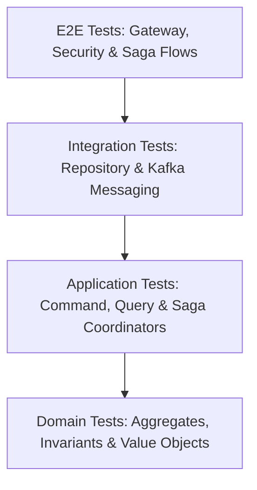

# Booking Service Testing Documentation

Tài liệu này ghi lại toàn bộ danh sách, cấu trúc và hướng dẫn thực hiện các bài kiểm thử (tests) đã được xây dựng và chạy thành công cho **Booking Service** (dịch vụ đặt lịch hẹn hò thuê bạn gái).

Hệ thống kiểm thử được thiết kế theo mô hình kim tự tháp (Testing Pyramid), bao gồm Unit Test cho Domain/VOs, Service Layer Unit Test, Integration Test cho Repository/Kafka, và E2E Test cho luồng Saga phức tạp kết hợp gRPC-Gateway.

---

## 1. Kiến Trúc Kiểm Thử (Testing Architecture)

Mã nguồn kiểm thử tuân thủ chặt chẽ **DDD (Domain-Driven Design) & Hexagonal Architecture**:



* **Domain layer (`vo`, `aggregate`)**: Kiểm thử logic nghiệp vụ thuần túy (Pure Business Logic), xác thực các ràng buộc nghiệp vụ (Invariants `[INV-XXXX]`) mà không phụ thuộc vào hạ tầng.
* **Application layer (`query`, `command`)**: Sử dụng Mocking/In-memory repositories để kiểm thử luồng nghiệp vụ, sự phối hợp điều hành SAGA Coordinator.
* **Infrastructure / Integration layer (`test`)**: Kiểm thử sự tích hợp thực tế với Cơ sở dữ liệu (PostgreSQL) thông qua GORM và hệ thống truyền tin (Kafka) sử dụng `docker-compose.test.yml`.
* **E2E / Security layer (`test`)**: Kiểm thử bảo mật (Role-based Authorization), sự hợp lệ của API Gateway (REST/gRPC) và các luồng đi từ cổng kết nối đến khi cập nhật DB.

---

## 2. Hướng Dẫn Chạy Kiểm Thử (Test Execution Guide)

Mọi tác vụ kiểm thử đã được tích hợp đầy đủ vào `Makefile` tại thư mục gốc của Booking Service.

### Khởi chạy Unit Tests (Chỉ chạy test cục bộ không cần hạ tầng):
```bash
make test-unit
```

### Khởi chạy E2E & Integration Tests (Khởi động Docker DB & Kafka, chạy test tích hợp và tự động dọn dẹp):
```bash
make test-e2e
```
*Lưu ý: Lệnh này tự động kéo các container Postgres và Kafka lên, đợi cho đến khi chúng Healthy (`healthcheck` đầy đủ), chạy toàn bộ các integration/E2E test suite và dọn dẹp (Tear down) sạch sẽ tài nguyên.*

---

## 3. Danh Sách Các Bài Kiểm Thử Chi Tiết

Dưới đây là bảng đăng ký đầy đủ tất cả các bài kiểm thử đã được xây dựng trong hệ thống:

### 3.1. Domain Value Objects Tests
Nằm tại: [internal/domain/vo/vo_test.go](file:///e:/LEAN/SOA/rent-a-girlfriend/services/booking-service/internal/domain/vo/vo_test.go)

Kiểm thử tính đúng đắn và khả năng tự bảo vệ dữ liệu của các Value Objects cốt lõi:

| Tên Hàm Test | Mục Tiêu & Ràng Buộc Kiểm Thử |
| :--- | :--- |
| `TestBookingID_NewAndParse` | Kiểm tra việc tạo mới và phân tích UUID hợp lệ của `BookingID`. |
| `TestBookingID_InvalidString` | Đảm bảo hệ thống từ chối các chuỗi định dạng UUID không hợp lệ. |
| `TestMoney_Validation` | Xác thực số lượng Kano-Coin phải không được âm. |
| `TestTimeRange_Validation` | Xác thực khoảng thời gian thuê (bắt đầu và kết thúc) phải hợp lệ. |
| `TestTimeRange_EndBeforeStart` | Ngăn chặn lỗi thời gian kết thúc diễn ra trước thời gian bắt đầu. |
| `TestScenarioSnapshot_Validation` | Xác thực bản sao thông số Scenario (giá, cấu hình, điều khoản) tại thời điểm đặt. |
| `TestBookingStatus_Transitions` | Xác thực các bước chuyển đổi trạng thái hợp lệ của Booking (vòng đời trạng thái). |
| `TestActorRole_Validation` | Kiểm soát phân quyền các vai trò hợp lệ (`Client`, `Companion`). |
| `TestIsLateCancel` | Kiểm tra chính xác logic hủy muộn (trong vòng 24h so với thời điểm hẹn). |

### 3.2. Domain Aggregates & Invariants Tests
Nằm tại: [internal/domain/aggregate/booking_test.go](file:///e:/LEAN/SOA/rent-a-girlfriend/services/booking-service/internal/domain/aggregate/booking_test.go)

Đảm bảo tất cả quy tắc nghiệp vụ bất biến (Invariants) được tuân thủ nghiêm ngặt trong Aggregate Root `Booking`:

| Tên Hàm Test | Quy Tắc Nghiệp Vụ Kiểm Thử (Ubiquitous Language) |
| :--- | :--- |
| `TestNewBooking_Success` | Tạo yêu cầu đặt lịch mới thành công khi tất cả thông số hợp lệ. |
| `TestNewBooking_INV_B01_TooSoon` | **[INV-B01]** Thời điểm đặt lịch phải cách hiện tại ít nhất 3 giờ. |
| `TestNewBooking_INV_B02_DurationMismatch` | **[INV-B02]** Thời gian đặt lịch phải khớp chính xác với cấu hình Scenario. |
| `TestAccept_INV_B03_Success` | **[INV-B03]** Companion chấp nhận lịch hẹn đang ở trạng thái `PENDING`. |
| `TestAccept_INV_B03_WrongStatus` | **[INV-B03]** Ngăn chặn việc Accept nếu lịch hẹn không ở trạng thái `PENDING`. |
| `TestAccept_WrongCompanion` | Ngăn Companion khác (không thuộc lịch hẹn) thực hiện hành động Accept. |
| `TestReject_INV_B03_Success` | Companion từ chối yêu cầu đặt lịch hẹn, chuyển trạng thái sang `REJECTED`. |
| `TestCancel_INV_B05_Success` | Hủy thành công một yêu cầu đặt lịch hợp lệ. |
| `TestCancel_INV_B05_AlreadyCompleted` | **[INV-B05]** Không thể hủy lịch hẹn đã hoàn thành (`COMPLETED`). |
| `TestCancel_LateCancellation` | Xử lý kịch bản hủy muộn (Late Cancellation) dẫn đến phạt hoặc mất phí. |
| `TestCancel_EarlyCancellation` | Xử lý kịch bản hủy sớm (Early Cancellation) hoàn tiền đầy đủ. |
| `TestCancel_ClientEarly` | Client hủy lịch sớm: Hoàn trả 100% Kano-Coin cho Client. |
| `TestCancel_ClientLate` | Client hủy lịch muộn: Phạt Client 100% số coin (chuyển cho Companion). |
| `TestCancel_CompanionEarly` | Companion hủy lịch sớm: Hoàn trả 100% Kano-Coin cho Client. |
| `TestCancel_CompanionLate` | Companion hủy lịch muộn: Hoàn tiền cho Client, Companion bị phạt/ghi nhận. |
| `TestCancel_CancelPendingBooking` | Hủy cuộc hẹn khi vẫn đang ở trạng thái `PENDING` (chưa được duyệt). |
| `TestCancel_FailTechnical` | Bảo vệ hệ thống khi trạng thái hủy không hợp lệ. |
| `TestSystemComplete_Success` | Hệ thống tự động chuyển trạng thái sang `COMPLETED` sau khi hết thời gian hẹn. |
| `TestSystemComplete_InvalidStatus` | Ngăn chặn hệ thống tự động hoàn thành nếu chưa được `CONFIRMED`. |
| `TestDispute_Success` | Khách hàng mở khiếu nại (Dispute), chuyển trạng thái sang `DISPUTED` để đóng băng Escrow. |
| `TestDispute_InvalidStatus` | Chỉ cho phép mở khiếu nại đối với cuộc hẹn đã được chấp nhận. |

### 3.3. Application Queries Tests
Nằm tại:
* [internal/application/query/get_booking_test.go](file:///e:/LEAN/SOA/rent-a-girlfriend/services/booking-service/internal/application/query/get_booking_test.go)
* [internal/application/query/list_bookings_test.go](file:///e:/LEAN/SOA/rent-a-girlfriend/services/booking-service/internal/application/query/list_bookings_test.go)

Kiểm tra tầng truy vấn dữ liệu (Read-Model / Queries):

| Tên Hàm Test | File Phụ Trách | Mục Tiêu Kiểm Thử |
| :--- | :--- | :--- |
| `TestGetBooking_Success` | `get_booking_test.go` | Lấy chi tiết lịch hẹn thành công theo ID. |
| `TestGetBooking_NotFound` | `get_booking_test.go` | Trả về lỗi rõ ràng khi không tìm thấy lịch hẹn. |
| `TestListBookings_Success` | `list_bookings_test.go` | Danh sách lịch hẹn được truy vấn đúng bộ lọc. |
| `TestListBookings_Pagination` | `list_bookings_test.go` | Đảm bảo cơ chế phân trang hoạt động chính xác. |

### 3.4. Application Commands & Saga Coordinator Tests
Nằm tại: [internal/application/command/saga_coordinator_test.go](file:///e:/LEAN/SOA/rent-a-girlfriend/services/booking-service/internal/application/command/saga_coordinator_test.go)

Kiểm tra sự điều phối nghiệp vụ phân tán thông qua SAGA Coordinator:

| Tên Hàm Test | Kịch Bản & Giao Dịch Phân Tán (SAGA Flow) |
| :--- | :--- |
| `TestSagaCoordinator_HandleEscrowSuccess` | Khi tài khoản Client đủ Kano-Coin và hệ thống đóng băng tiền thành công vào Escrow. |
| `TestSagaCoordinator_HandleEscrowFailed` | Khi tài khoản Client không đủ Kano-Coin, thực hiện bồi hoàn (Compensate) và hủy yêu cầu. |
| `TestSagaCoordinator_HandleChatRoomCreated_Success`| Khi phòng chat được khởi tạo thành công giữa Client và Companion. |
| `TestSagaCoordinator_HandleChatRoomCreated_OverlapCompensation` | Bồi hoàn phòng chat nếu phát hiện trùng lịch hẹn khác được xác nhận trước đó. |
| `TestSagaCoordinator_HandleChatRoomFailed` | Khởi tạo phòng chat thất bại, thực hiện bồi hoàn giải phóng quỹ Escrow. |
| `TestSagaCoordinator_HandleRefundSuccess` | Luồng bồi hoàn thành công giải phóng Escrow và hoàn coin về cho Client. |
| `TestSagaCoordinator_HandleRefundFailed` | Kịch bản bồi hoàn lỗi, ghi nhận cảnh báo nguy hiểm cấp độ hệ thống để can thiệp thủ công. |

### 3.5. Contracts & Serialization Tests
Nằm tại: [test/contracts_test.go](file:///e:/LEAN/SOA/rent-a-girlfriend/services/booking-service/test/contracts_test.go)

Kiểm tra tính tương thích dữ liệu truyền tải qua mạng (Network Contracts):

| Tên Hàm Test | Mục Tiêu Kiểm Thử |
| :--- | :--- |
| `TestProtobufSerialization_Contracts` | Đảm bảo các cấu trúc Domain Event tương thích ngược/xuôi khi tuần tự hóa qua Protobuf JSON CloudEvents. |
| `TestProtobufEnumMappping_Contracts` | Đảm bảo ánh xạ chính xác các Enum nghiệp vụ giữa Domain và các lớp định nghĩa Protobuf. |

### 3.6. Integration Tests (Database Repositories)
Nằm tại: [test/integration_test.go](file:///e:/LEAN/SOA/rent-a-girlfriend/services/booking-service/test/integration_test.go)

Kiểm thử tích hợp thực tế với PostgreSQL (chạy trong Docker Container):

| Tên Hàm Test | Mục Tiêu Kiểm Thử |
| :--- | :--- |
| `TestBookingRepository_Integration` | Đảm bảo `GORM` lưu trữ, truy vấn, và cập nhật chính xác trạng thái thực của `Booking` xuống Database thực tế. |
| `TestBookingSagaRepository_Integration` | Kiểm tra sự bền vững (Persistence) của các phiên Saga State trong DB để đảm bảo phục hồi giao dịch khi xảy ra crash. |

### 3.7. End-to-End (E2E) & Security Tests
Nằm tại: [test/e2e_test.go](file:///e:/LEAN/SOA/rent-a-girlfriend/services/booking-service/test/e2e_test.go)

Kiểm thử xuyên suốt lớp mạng HTTP/gRPC-Gateway tích hợp ma trận phân quyền người dùng (Security Matrix):

| Tên Hàm Test | Kịch Bản Kiểm Thử |
| :--- | :--- |
| `TestE2E_GetBooking_SecurityMatrix` | Xác thực ma trận phân quyền: Chỉ Client đặt lịch, Companion được đặt, hoặc Admin mới có quyền truy cập thông tin đặt lịch. Những người khác sẽ bị từ chối với mã lỗi thích hợp. |
| `TestE2E_ListBookings_RoleFilters` | Xác thực API lọc danh sách lịch hẹn tự động tiêm vai trò theo Header (`user-id`, `user-role`). |
| `TestE2E_RequestBooking_SuccessAndFailure` | Giả lập Client gửi yêu cầu tạo lịch mới qua HTTP REST (gRPC-Gateway) và kiểm tra phản hồi thành công/thất bại. |
| `TestE2E_AcceptBooking_Success` | Giả lập Companion gửi yêu cầu chấp nhận đặt lịch hẹn qua HTTP REST. |
| `TestE2E_RejectBooking_Success` | Giả lập Companion gửi yêu cầu từ chối đặt lịch hẹn qua HTTP REST. |
| `TestE2E_CancelBooking_Success` | Giả lập Client/Companion gửi yêu cầu hủy lịch hẹn qua HTTP REST. |

### 3.8. E2E Distributed Saga Tests (Kafka & DB Integration)
Nằm tại: [test/saga_test.go](file:///e:/LEAN/SOA/rent-a-girlfriend/services/booking-service/test/saga_test.go)

Mô phỏng toàn bộ hành trình giao dịch phân tán (Distributed Transaction) thực tế chạy qua Message Broker Kafka và PostgreSQL:

| Tên Hàm Test | Kịch Bản Mô Phỏng |
| :--- | :--- |
| `TestSagaLifecycle_E2E_Kafka` | Đăng ký toàn bộ các Topic kiểm thử (`dispute-events-test`, `interaction-events-test`, `finance-events-test`). Giả lập sự kiện đóng băng tiền (`CoinEscrowed`), tạo phòng chat (`ChatRoomCreated`) và đảm bảo trạng thái Booking chuyển dịch mượt mà qua các bước mà không gặp lỗi nghẽn hoặc Rebalance của Kafka. |

---

## 4. Những Điểm Nhấn Công Nghệ Được Giải Quyết Trong Quá Trình Phát Triển Tests

Trong quá trình xây dựng và hoàn thiện hệ thống kiểm thử này, các vấn đề kỹ thuật phức tạp đã được khắc phục triệt để:

1. **Cô Lập Kafka GroupID Để Tránh Rebalance**:
   * *Hiện tượng*: Khi nhiều reader đăng ký chung một `GroupID` nhưng lắng nghe các topic khác nhau, Kafka rơi vào vòng lặp Rebalance vô hạn làm nghẽn luồng test.
   * *Giải pháp*: Mỗi reader trong môi trường kiểm thử được tự động tạo một GroupID cô lập theo công thức `GroupID: groupID + "-" + topic`.
2. **Khởi Tạo Trước Topic (Pre-create Topics)**:
   * Tránh độ trễ do tự động tạo topic (`Auto Topic Creation`), hệ thống kiểm thử khởi chạy lệnh tạo Topic trực tiếp trong Kafka container ngay khi khởi động nhằm đảm bảo metadata ổn định trước khi test suites chạy.
3. **Ma Trận Bảo Mật (Security Matrix)**:
   * Giả lập đầy đủ cơ chế **Auth Offloading** của Istio Waypoint bằng cách tiêm (inject) các HTTP Header (`user-id`, `user-role`) trực tiếp vào các cuộc gọi API.
