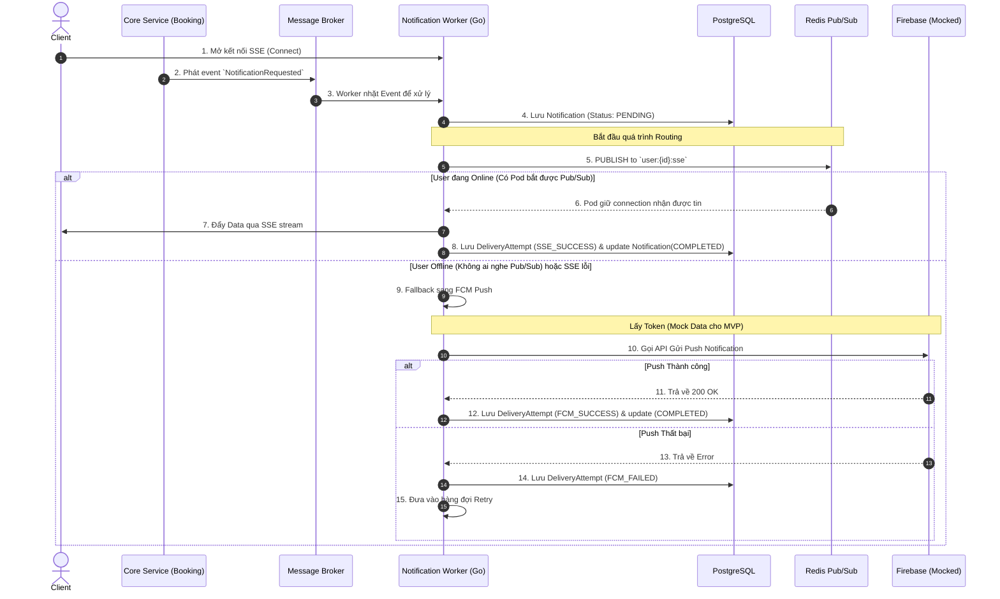

# 🏗️ KIẾN TRÚC HỆ THỐNG VÀ LUỒNG DỮ LIỆU (SYSTEM ARCHITECTURE & FLOW)

Tài liệu này cung cấp bức tranh toàn cảnh về mặt kỹ thuật của Notification Service. Thiết kế ưu tiên sự đồng thời (concurrency), khả năng mở rộng ngang (horizontal scaling) và giải quyết bài toán giao tiếp thời gian thực trong môi trường phân tán.

> [!TIP]
> **Triết lý Thiết kế (Tech Stack Agnostic nhưng Golang-Oriented)**
> Dù mô hình dưới đây có thể áp dụng bằng mọi ngôn ngữ, nhưng nó được tối ưu hóa cho **Golang**. Tận dụng sức mạnh của Goroutines và Channels để xử lý hàng chục ngàn kết nối SSE đồng thời (Concurrent Connections) mà không ngốn nhiều RAM.

---

## 1. THÀNH PHẦN KỸ THUẬT (TECH STACK COMPONENTS)

Hệ thống xoay quanh các thành phần sau:
1. **Event Bus (RabbitMQ / Kafka)**: Trạm thu phát tín hiệu. Nhận `NotificationRequested` từ các Core Services.
2. **PostgreSQL**: Nơi lưu trữ trạng thái (Persistence). Dùng ORM (như `gorm`) để quản lý `Notification` và `DeliveryAttempt`.
3. **Redis Pub/Sub**: Trái tim của hệ thống SSE phân tán. Dùng để "bắn tin" giữa các Pods (Instances) của Notification Service.
4. **FCM (Firebase Cloud Messaging)**: Provider bên thứ 3 để gửi Push Notification.
5. **SSE (Server-Sent Events)**: Giao thức một chiều (Server -> Client) dùng để đẩy Realtime lên Web/App với độ trễ siêu thấp.

---

## 2. BÀI TOÁN PHÂN TÁN (DISTRIBUTED SSE PROBLEM)

**Vấn đề:** 
Hệ thống có thể chạy 3 instances của Notification Service (Pod A, Pod B, Pod C) đằng sau 1 Load Balancer.
- Client X đang kết nối SSE vào **Pod A**.
- Event `NotificationRequested` (dành cho Client X) lại được RabbitMQ phân phối ngẫu nhiên cho Worker ở **Pod C** xử lý.
- Làm sao Pod C đẩy được tin nhắn xuống Client X khi nó không giữ connection của X?

**Giải pháp: Sử dụng Redis Pub/Sub**
- Khi Pod C muốn gửi SSE cho Client X, nó không thể gửi trực tiếp. Thay vào đó, Pod C sẽ **Publish** một message vào kênh (Topic) trên Redis, ví dụ: `channel:user_x:sse`.
- Tất cả các Pod (A, B, C) đều **Subscribe** vào cụm kênh của Redis.
- Pod A nghe thấy có tin nhắn trên kênh `channel:user_x:sse`. Nó tự nhận thấy: *"À, mình đang giữ connection của User X"*, và thực hiện đẩy message xuống thiết bị qua kênh SSE của mình. Pod B và C phớt lờ message đó.

---

## 3. SƠ ĐỒ LUỒNG DỮ LIỆU CHÍNH (CORE DATA FLOW)

Dưới đây là luồng xử lý từ lúc có Event đến khi tin nhắn tới được Client. Theo như cấu hình MVP (tại ADR-0001), hệ thống ưu tiên luồng SSE và sẽ **Mock data FCM Token** để tối ưu tốc độ phát triển giai đoạn đầu.

---

## 4. CHIẾN LƯỢC XỬ LÝ ĐỒNG THỜI (CONCURRENCY STRATEGY)

Trong môi trường Golang, chúng ta áp dụng các Pattern sau:

### 4.1. SSE Connection Pool (Local Memory)
Mỗi Instance sẽ duy trì một `ConnectionManager` (Thường là một `map[string]*Client`).
- Key: `UserId`
- Value: Một Struct `Client` chứa Go Channel (`chan []byte`) để bắn dữ liệu ra HTTP Response Writer.
- Phải dùng `sync.RWMutex` hoặc `sync.Map` để đảm bảo Thread-safe khi có user connect/disconnect liên tục.

### 4.2. Worker Pool cho việc gửi FCM (Outbound Requests)
Thay vì mỗi Event khởi tạo 1 Goroutine tự do gọi ra ngoài FCM (có thể gây cạn kiệt tài nguyên mạng và bị Google block IP do spam), ta sử dụng **Worker Pool**.
- Khởi tạo ví dụ: 50 Workers chạy ngầm.
- Các requests gửi Push sẽ được ném vào một `JobQueue` (Go Channel). 50 Workers này sẽ lần lượt bốc Job ra gọi API FCM. Điều này giới hạn chính xác số lượng Concurrent Requests gửi đi Firebase.

### 4.3. Cơ chế Retry (Exponential Backoff)
Nếu gửi FCM thất bại (do Network lỗi, Firebase sập):
- Lần thử 1: Chờ 2 giây.
- Lần thử 2: Chờ 4 giây.
- Lần thử 3: Chờ 8 giây.
- Nếu thất bại quá 3 lần: Lưu `FAILED` theo đúng Invariant `[INV-N01]` trong Domain Model.
- **Implement**: Việc chờ đợi sẽ không được dùng `time.Sleep()` gây block worker, mà sẽ bắn một message trì hoãn (Delayed Message) lại vào hàng đợi nội bộ hoặc Broker để xử lý sau.
