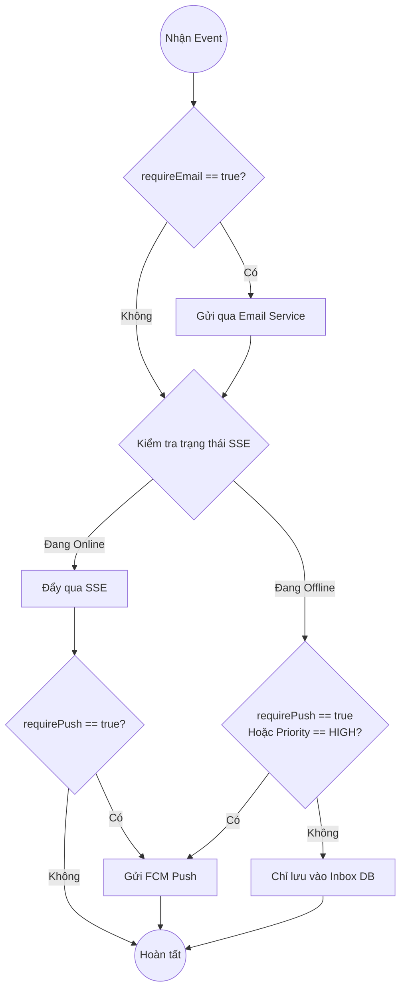

# 🔀 LUẬT ĐỊNH TUYẾN THÔNG BÁO (ROUTING POLICY)

Tài liệu này định nghĩa các quy tắc (Rules) cực kỳ đơn giản và rõ ràng về việc: **Một thông báo sẽ được gửi qua kênh nào (SSE, FCM hay Email)?** 

Nguyên tắc cốt lõi: Notification Service **KHÔNG TỰ SUY DIỄN** nghiệp vụ. Nó hoạt động dựa trên 2 yếu tố: 
1. Trạng thái kết nối của người dùng (Online / Offline).
2. Cấu hình (Policy Overrides) do Service nguồn (VD: Booking, Finance) truyền vào.

---

## 1. CÁC KÊNH GIAO TIẾP VÀ VAI TRÒ

| Kênh (Channel) | Tốc độ | Đặc điểm | Khi nào sử dụng? |
| :--- | :--- | :--- | :--- |
| **SSE** (Server-Sent Events) | Realtime | Chậm nhất nhưng rẻ nhất. Chỉ hoạt động khi User đang mở App. | Luôn luôn thử gửi trước nếu User đang Online. |
| **FCM Push** (Firebase) | Trễ nhẹ | Đánh thức thiết bị. Cần có Device Token. | Khi User Offline và thông báo đủ quan trọng để làm phiền họ. |
| **Email** | Chậm | Lưu trữ lâu dài, trang trọng. | Các tác vụ quan trọng: Đổi mật khẩu, Hóa đơn tài chính. |

---

## 2. LUẬT ĐỊNH TUYẾN ĐƠN GIẢN (SIMPLE ROUTING RULES)

Khi nhận được một thông điệp (Event) từ Message Queue, hệ thống sẽ chạy qua 3 bước kiểm tra (Rule) sau:

### Rule 1: Xử lý Email (Độc lập)
- Nếu Event có truyền cờ `requireEmail: true`:
  - Gửi ngay nội dung qua kênh Email.
  - *Việc gửi Email hoàn toàn độc lập và không phụ thuộc vào việc User đang Online hay Offline.*

### Rule 2: Giao tiếp thời gian thực (SSE First)
- Kiểm tra danh sách kết nối SSE hiện tại của `userId`.
- Nếu có **ít nhất 1 kết nối đang mở (Online)**:
  - Đẩy thông báo qua tất cả các kết nối SSE đó.
  - **Dừng luồng gửi Push (FCM)** (Trừ khi Service nguồn ép buộc bằng Rule 3).

### Rule 3: Giao tiếp đánh thức (FCM Push Fallback)
- Hệ thống sẽ gọi API của Firebase (FCM) để gửi Push Notification nếu thỏa mãn **MỘT TRONG CÁC** điều kiện sau:
  - User hoàn toàn **Offline** (Không có kết nối SSE nào).
  - Kết nối SSE có nhưng bị đứt ngang lúc đang gửi.
  - Service nguồn cố tình ép buộc gửi Push (truyền cờ `requirePush: true`) bất chấp việc User đang Online.

> [!TIP]
> **Tóm tắt ngắn gọn:**
> Email gửi riêng theo lệnh. Còn lại, cứ Online thì bắn SSE, Offline thì bắn Push (FCM). Nếu Service nguồn bắt buộc Push thì vừa SSE vừa Push.

---

## 3. SƠ ĐỒ QUYẾT ĐỊNH (DECISION TREE)

---

## 4. QUẢN LÝ LỖI VÀ THỬ LẠI (RETRY MECHANISM)

Tuân thủ bất biến `[INV-N01]`:
- **Đối với SSE (Vấn đề mất kết nối ở tầng TCP/Kernel):**
  Bản chất SSE chạy trên một TCP socket mở liên tục. Khi Client mất kết nối đột ngột (rớt mạng, sập nguồn) mà không kịp gửi cờ `TCP FIN` hoặc `RST`, HĐH (Kernel) của Server vẫn giữ trạng thái socket là `ESTABLISHED`. Lúc này, hệ thống sẽ đối mặt với các kịch bản low-level sau:
  1. **Ảo giác khi Ghi dữ liệu (Kernel Send Buffer):** Khi ứng dụng (Golang) thực hiện syscall `write()` để đẩy payload SSE, dữ liệu thực chất chỉ được copy vào **Socket Send Buffer** của OS. Nếu buffer chưa đầy, hàm `write()` sẽ **trả về thành công ngay lập tức** dù gói tin chưa hề tới Client. Gói tin này sẽ bị kẹt ở tầng TCP: Kernel cố gửi đi, không nhận được `TCP ACK` từ Client, và sẽ liên tục retransmit (gửi lại) ngầm. Gói Notification đó coi như "mất trắng" mà Application layer không hề hay biết.
  2. **Phát hiện độ trễ (EPIPE / ECONNRESET):** Chỉ khi Kernel cạn kiệt số lần TCP retransmission (thường là 15-30 phút tùy cấu hình `tcp_retries2` của Linux), hoặc khi Send Buffer đầy, thì các lệnh `write()` tiếp theo của ứng dụng mới thực sự văng lỗi `EPIPE` (Broken pipe) hoặc `ECONNRESET`. Khi bắt được lỗi này ở Application layer, Server mới dọn dẹp connection và ghi nhận `DeliveryAttempt` là FAILED.
  3. **Giải pháp cốt lõi (Heartbeat & Keepalive):** Vì không thể tin tưởng vào lỗi syscall `write()` tại đúng thời điểm phát sinh sự kiện, hệ thống BẮT BUỘC phải bật cờ **TCP Keepalive** (với thời gian thăm dò cực ngắn) ở tầng socket, kết hợp với **Application-level Heartbeat** (gửi packet `: ping\n\n` mỗi 15s). Nếu việc đẩy Heartbeat làm tràn Send Buffer hoặc kích hoạt lỗi TCP nhanh hơn, Server sẽ phát hiện kết nối chết sớm nhất có thể để chủ động Fallback sang luồng **FCM Push**.
- **Đối với FCM/Email:** Nếu gọi API Firebase hoặc SMTP bị lỗi mạng (Timeout/503), thực hiện Retry tối đa 3 lần với thuật toán **Exponential Backoff** (ví dụ: chờ 1s, 2s, 4s). Quá 3 lần sẽ đánh dấu trạng thái thông báo là `FAILED` và cảnh báo lên hệ thống giám sát.
