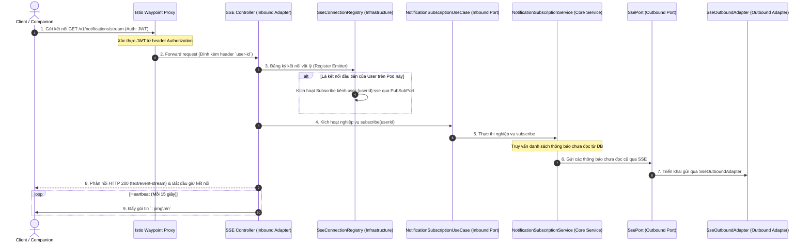

# 📄 PRODUCT REQUIREMENTS DOCUMENT (PRD) - PHASE 2: SSE REALTIME DELIVERY

## 🛠️ TÀI LIỆU ĐẶC TẢ SẢN PHẨM & YÊU CẦU KỸ THUẬT (VERSION 1.1)
*   **Thành phần:** Notification Service (Dịch vụ Thông báo)
*   **Giai đoạn:** Phase 2: SSE Realtime Delivery (Cổng chuyển phát thời gian thực)
*   **Mục tiêu:** Xây dựng cổng giao tiếp Server-Sent Events (SSE) non-blocking hiệu năng cao, hỗ trợ đa kết nối của User, an toàn tài nguyên bộ nhớ và chạy hoàn toàn trên **hạ tầng Redis Docker** (cho cả môi trường Dev cục bộ và Production) nhằm đảm bảo tính đồng nhất hệ thống tuyệt đối.

---

## 1. GIỚI THIỆU & BỐI CẢNH (OVERVIEW & GOAL)
Trong hệ sinh thái **Rent-a-Girlfriend**, các giao dịch tương tác giữa **Client** và **Companion** yêu cầu tính phản hồi cực kỳ nhanh nhạy: yêu cầu đặt lịch, biến động tài khoản **Kano-Coin**, tin nhắn chat mới hay kết quả xử lý tranh chấp **Escrow** cần được đẩy tới thiết bị người dùng ngay lập tức.

**Phase 2: SSE Realtime Delivery** hiện thực hóa kênh chuyển phát "SSE First" được quy định trong Routing Policy của BRD. Nó đóng vai trò là ống dẫn dữ liệu tốc độ cao một chiều (Server-to-Client), được tối ưu bằng **Java 21 Virtual Threads** kết hợp **Redis Pub/Sub thật chạy trên Docker** để đảm bảo khả năng chịu tải hàng chục ngàn kết nối đồng thời với độ trễ tối thiểu và đồng nhất 100% môi trường hoạt động.

---

## 2. KỊCH BẢN NGHIỆP VỤ & LUỒNG XỬ LÝ (USECASES & DATA FLOWS)



### 2.1. Usecase 1: Thiết lập kết nối thời gian thực (Handshake)
*   **Tác nhân:** Client (Web/Mobile) đã đăng nhập hệ thống.
*   **Luồng xử lý chính:**
    1.  Client gửi yêu cầu `GET /v1/notifications/stream` với header `Accept: text/event-stream`.
    2.  Hệ thống chạy trên Production sẽ đi qua **Istio Waypoint Proxy** để xác thực JWT. Istio inject header **`user-id`** chứa UUID của user rồi forward tới ứng dụng.
    3.  Tại local dev (chạy profile `local` hoặc `dev`), nếu không tìm thấy header `user-id`, bộ lọc `MockAuthFilter` sẽ tự động mock một `user-id` mặc định để lập trình viên dễ dàng chạy thử.
    4.  Ứng dụng tạo một đối tượng `SseEmitter` của Spring MVC, thiết lập các callbacks xử lý sự kiện đứt kết nối (`onCompletion`, `onTimeout`, `onError`).
    5.  Ứng dụng thêm `SseEmitter` vào `SseConnectionRegistry`.
    6.  Server trả về response HTTP 200 với các header tiêu chuẩn của SSE:
        *   `Content-Type: text/event-stream;charset=UTF-8`
        *   `Cache-Control: no-cache`
        *   `Connection: keep-alive`

### 2.2. Usecase 2: Đẩy tin nhắn Realtime Đa thiết bị (Multi-device Delivery)
*   **Bối cảnh:** User X đang online đồng thời trên Web Chrome và App Điện thoại di động (có 2 kết nối active trên cùng 1 Pod hoặc trên 2 Pod khác nhau).
*   **Luồng xử lý:**
    1.  Khi một thông báo mới phát sinh cho User X, Worker xử lý sẽ gọi `PubSubPort.publish("user:" + userId + ":sse", payload)`.
    2.  **Redis Docker** sẽ định tuyến gói tin đến tất cả các Pod đang subscribe kênh `user:{userId}:sse` của User X.
    3.  Tại mỗi Pod nhận được tin: `SseConnectionRegistry` sẽ được quét để tìm danh sách kết nối của User X (`List<SseEmitter>`).
    4.  Hệ thống lặp qua danh sách Emitter cục bộ, ghi dữ liệu (payload) trực tiếp xuống các socket đang mở của User X. Người dùng sẽ nhận được thông báo hiển thị đồng thời trên tất cả các thiết bị đang dùng.

### 2.3. Usecase 3: Giữ kết nối và Tự động dọn dẹp (Keep-alive & Cleanup)
*   **Heartbeat:** Hệ thống định kỳ gửi gói tin comment `: ping\n\n` mỗi **15 giây** một lần cho mỗi kết nối để ngăn các Load Balancer (AWS ALB, Nginx, Istio Waypoint Proxy) đóng kết nối do idle timeout.
*   **Dọn dẹp tự động (Auto-Cleanup):**
    *   Khi Client tắt trình duyệt, mất mạng đột ngột hoặc điện thoại chuyển sang chế độ ngủ (sleep) không đóng socket sạch sẽ.
    *   Lần gửi tin tiếp theo hoặc lần gửi heartbeat tiếp theo sẽ throw ra lỗi `IOException` (Broken pipe / Connection reset by peer) ở tầng TCP socket.
    *   Hệ thống bắt lập tức trigger callback `onError` hoặc `onCompletion` đã đăng ký trên `SseEmitter`.
    *   Registry sẽ loại bỏ `SseEmitter` lỗi ra khỏi RAM cục bộ trong vòng tối đa **5 giây** để chống tràn RAM.
    *   Nếu đó là kết nối cuối cùng của User trên Pod đó (số lượng emitter giảm về `0`), hệ thống sẽ gửi lệnh unsubcribe kênh `user:{userId}:sse` lên Redis Docker.

### 2.4. Sơ đồ dòng đi chi tiết của dữ liệu (Step-by-Step Flow)

```
[LUỒNG A: GỬI THÔNG BÁO]
Kafka Event ➡️ SendNotificationUseCase ➡️ SsePort (SseOutboundAdapter) ➡️ PubSubPort (RedisPubSubAdapter) ➡️ Redis Docker

[LUỒNG B: PHÂN PHỐI THỜI GIAN THỰC]
Redis Docker ➡️ RedisPubSubAdapter (MessageListener) ➡️ SseConnectionRegistry (RAM) ➡️ SseEmitter ➡️ Client Screen
```

#### 🔄 LUỒNG A: GỬI THÔNG BÁO (Pod C nhận Event từ Kafka ➡️ Gửi lên Redis)
Giả sử **Pod C** nhặt được sự kiện gửi tin từ Kafka, nó phát hiện User X đang Online và quyết định gửi qua SSE:

1.  **`SendNotificationUseCase`** (Lõi nghiệp vụ) nhận được yêu cầu gửi tin và xác định kênh phân phối là SSE.
2.  Nó gọi **`SsePort`** (`internal/com/rentagf/notification/application/port/outbound/SsePort.java`).
3.  **`SseOutboundAdapter`** (`internal/com/rentagf/notification/infrastructure/adapter/SseOutboundAdapter.java`) triển khai `SsePort` sẽ chạy phương thức `send(Notification notification)`:
    *   *Hành động:* Nó chuyển đổi đối tượng `Notification` thành chuỗi JSON payload.
    *   *Hành động:* Nó gọi **`PubSubPort`** thông qua phương thức `publish("user:user_x:sse", payload)`.
4.  **`RedisPubSubAdapter`** (`internal/com/rentagf/notification/infrastructure/adapter/RedisPubSubAdapter.java`) triển khai `PubSubPort` sẽ thực hiện:
    *   *Hành động:* Sử dụng `StringRedisTemplate` của Spring Data Redis để gọi lệnh ghi:
        `redisTemplate.convertAndSend("user:user_x:sse", payload)`.
    *   *Kết quả:* Tin nhắn được đẩy thành công lên **Redis Docker Server** đang chạy trên cổng 6379.

#### 🔄 LUỒNG B: NHẬN TIN & ĐẨY XUỐNG CLIENT (Redis ➡️ Pod A giữ connection ➡️ Client)
Bây giờ, **Pod A** (đang duy trì kết nối socket thực tế của User X trong RAM) cần lấy tin từ Redis và ghi xuống socket:

1.  **Redis Docker Server** nhận được message trên kênh `user:user_x:sse` ➡️ Nó phát (broadcast) tin nhắn này tới tất cả các Pod đang subscribe kênh này.
2.  Tại **Pod A**: `RedisMessageListenerContainer` (được cấu hình trong file `RedisPubSubConfig.java`) bắt được tin nhắn.
3.  Nó kích hoạt callback chuyển tiếp tin nhắn tới **`RedisPubSubAdapter`** (`internal/com/rentagf/notification/infrastructure/adapter/RedisPubSubAdapter.java` - class này implement `org.springframework.data.redis.connection.MessageListener`).
4.  Bên trong hàm `onMessage(Message message, byte[] pattern)` của **`RedisPubSubAdapter`**:
    *   *Hành động 1:* Nó bóc tách tên kênh Redis để lấy ra `userId` của người nhận (từ `user:user_x:sse` tách được `userId = user_x`).
    *   *Hành động 2:* Nó bóc tách nội dung message thành chuỗi JSON payload.
    *   *Hành động 3:* Nó gọi **`SseConnectionRegistry`** (`internal/com/rentagf/notification/application/registry/SseConnectionRegistry.java`) thông qua hàm `getEmitters(userId)`.
5.  **`SseConnectionRegistry`** quét bộ nhớ RAM (`ConcurrentHashMap`) của Pod A và trả về danh sách kết nối **`List<SseEmitter>`** đang mở của User X.
6.  **`RedisPubSubAdapter`** duyệt qua danh sách `SseEmitter` này và thực hiện ghi dữ liệu trực tiếp xuống socket mạng:
    ```java
    emitter.send(SseEmitter.event()
        .id(notificationId)
        .name("notification")
        .data(payloadJson));
    ```
7.  **Kết quả:** Dữ liệu lập tức chạy qua card mạng TCP socket hiển thị thời gian thực trên màn hình của **Client**!

---


## 3. CẤU TRÚC KIẾN TRÚC KỸ THUẬT (TECHNICAL ARCHITECTURE)

Hệ thống áp dụng triết lý **Hexagonal Architecture** để phân tách rõ ràng giữa Logic điều khiển kết nối thời gian thực và Hạ tầng phân tán (Redis). Cả môi trường phát triển (Dev) và Production đều dùng chung một Adapter Redis thật để đảm bảo tính đồng nhất.

```
           [Interfaces Layer]                [Application Core]               [Infrastructure Layer]
        +-----------------------+        +-------------------------+      +---------------------------+
        |                       |        |                         |      |                           |
        |  SseController        | =====> | NotificationSubscription|      |  SseConnectionRegistry    |
        |  (Inbound Adapter)    |        | UseCase (Inbound Port)  |      |  (Emitter Registry)       |
        |                       |        |                         |      |                           |
        +-----------------------+        +-------------------------+      +---------------------------+
                                                      ||                                /\
                                                      \/                                || (Query Emitters)
                                         +-------------------------+                    ||
                                         |                         |                    ||
                                         | NotificationSubscription|                    ||
                                         | Service (Core Service)  |                    ||
                                         |                         |                    ||
                                         +-------------------------+                    ||
                                                      ||                                ||
                                                      \/ (Send Outbound)                ||
                                         +-------------------------+                    ||
                                         |                         |                    ||
                                         | SsePort (Outbound Port) | ===================+
                                         |                         |   (Triển khai bởi SseOutboundAdapter)
                                         +-------------------------+
```

### 3.1. Hướng dẫn chạy hạ tầng Redis cục bộ bằng Docker
Lập trình viên bắt buộc phải khởi tạo và chạy Redis Container cục bộ bằng Docker trước khi khởi động ứng dụng:
*   **Lệnh khởi chạy nhanh container Redis:**
    ```bash
    docker run -d --name rentagf-redis -p 6379:6379 redis:alpine
    ```
*   **Cấu hình kết nối trong file [.env](file:///e:/LEARN/rent-a-girlfriend/services/notification-service/.env):**
    ```properties
    REDIS_HOST=localhost
    REDIS_PORT=6379
    ```

### 3.2. Cấu trúc Thread-Safe Registry (`SseConnectionRegistry`)
Registry được thiết kế an toàn đa luồng bằng cách sử dụng `ConcurrentHashMap` kết hợp `CopyOnWriteArrayList` để lưu trữ nhiều thiết bị của 1 User:
```java
private final Map<UUID, List<SseEmitter>> registry = new ConcurrentHashMap<>();
```
*   **Cơ chế Reference Counting (Đếm kết nối):**
    *   Khi thêm kết nối (`register`):
        ```java
        List<SseEmitter> emitters = registry.computeIfAbsent(userId, key -> {
            // Đây là kết nối đầu tiên của User trên Pod này -> Subscribe kênh hạ tầng
            pubSubPort.subscribe("user:" + userId + ":sse");
            return new CopyOnWriteArrayList<>();
        });
        emitters.add(emitter);
        ```
    *   Khi xóa kết nối (`unregister`):
        ```java
        List<SseEmitter> emitters = registry.get(userId);
        if (emitters != null) {
            emitters.remove(emitter);
            if (emitters.isEmpty()) {
                // Đã ngắt kết nối cuối cùng -> Giải phóng subscription trên hạ tầng Redis
                registry.remove(userId);
                pubSubPort.unsubscribe("user:" + userId + ":sse");
            }
        }
        ```

### 3.3. Outbound Port và Redis Adapter
*   **`PubSubPort` (Interface):**
    ```java
    public interface PubSubPort {
        void publish(String channel, String message);
        void subscribe(String channel);
        void unsubscribe(String channel);
    }
    ```
*   **`RedisPubSubAdapter` (Triển khai chính thức):**
    *   Sử dụng Spring Data Redis `RedisMessageListenerContainer` để subscribe/unsubscribe động các kênh theo User.
    *   Gửi thông báo qua `redisTemplate.convertAndSend(channel, message)`.

### 3.4. Đặc tả Hợp đồng dữ liệu SSE (Event Stream Format)
Mọi gói tin dữ liệu SSE gửi xuống Client bắt buộc phải tuân thủ định dạng HTTP Event Stream:

*   **Heartbeat Gói tin (Ping):**
    ```text
    : ping\n\n
    ```
*   **Thông báo thực tế (Data Event):**
    ```text
    id: 9b1deb4d-3b7d-4bad-9bdd-2b0d7b3dcb6d
    event: notification
    retry: 5000
    data: {"title":"Biến động số dư","body":"Tài khoản của bạn đã được cộng +100 Kano-Coin từ Escrow.","type":"TRANSACTIONAL","priority":"HIGH"}
    
    ```
    *Lưu ý: Luôn kết thúc bằng đúng 2 ký tự xuống dòng `\n\n` để kết thúc một Frame dữ liệu theo chuẩn RFC 6455/SSE.*

---

## 4. CÁC QUY TẮC BẤT BIẾN NGHIỆP VỤ (BUSINESS INVARIANTS)

Lớp SSE Core phải bảo vệ nghiêm ngặt 2 quy tắc bất biến (Business Invariants) mới được cập nhật trong BRD:

*   **`[INV-N04] - Đảm bảo dọn dẹp kết nối chết (Dead Connection Cleanup)`**:
    Khi phát hiện lỗi ghi dữ liệu hoặc heartbeat do socket hỏng (`IOException`), hệ thống bắt buộc phải giải phóng đối tượng `SseEmitter`, dọn dẹp registry cục bộ và thực hiện giảm số đếm kết nối trong vòng tối đa **5 giây** để bảo vệ dung lượng bộ nhớ RAM của Pod.
*   **`[INV-N05] - Giới hạn tần suất Heartbeat (Heartbeat Frequency)`**:
    Tần suất gửi heartbeat bắt buộc phải đặt cố định là **15 giây một lần**. Nghiêm cấm thay đổi tần suất này một cách tùy tiện mà không có sự đồng ý của quản trị hệ thống, nhằm tránh việc Load Balancer ngắt kết nối hoặc tạo ra tải I/O quá lớn lên CPU.

---

## 5. KẾ HOẠCH KIỂM THỬ & XÁC MINH (VERIFICATION PLAN)

Do SSE và đa luồng cực kỳ dễ xảy ra các lỗi bất đồng bộ (Race Conditions, Deadlocks), kế hoạch kiểm thử phải được thực thi nghiêm ngặt theo quy tắc **TDD (Test-Driven Development)**:

### 5.1. Unit Tests (Kiểm thử đơn vị)
*   **Mục tiêu:** Kiểm tra logic đăng ký, dọn dẹp, đếm kết nối và tính thread-safe của Connection Registry.
*   **Các kịch bản bắt buộc viết Test:**
    1.  Test thêm kết nối mới của User -> Số đếm tăng, kích hoạt subscribe.
    2.  Test thêm kết nối thứ 2 của cùng User -> Danh sách tăng lên 2, KHÔNG gọi subscribe lần nữa.
    3.  Test ngắt 1 kết nối khi User đang online 2 thiết bị -> Danh sách giảm về 1, KHÔNG gọi unsubscribe.
    4.  Test ngắt kết nối cuối cùng -> Giải phóng registry thành công, kích hoạt unsubscribe.
    5.  **Concurrency Stress Test:** Giả lập 100 Platform Threads đồng thời gọi register và unregister cho cùng một `userId` để đảm bảo registry không bị ném ra `ConcurrentModificationException` và không bị sai lệch số đếm (Reference Count).

### 5.2. Integration Tests (Kiểm thử tích hợp)
*   **Mục tiêu:** Kiểm tra tích hợp Spring Boot, SSE Controller, và Redis Pub/Sub thật.
*   **Công cụ:** Spring MockMVC kết hợp với **Testcontainers Redis** hoặc kết nối trực tiếp đến **Redis Docker local**.
*   **Kịch bản test:**
    1.  Khởi chạy Context Spring Boot tích hợp cấu hình Redis.
    2.  Gọi `GET /v1/notifications/stream` có header `user-id` hợp lệ -> Kết nối thành công, nhận được gói tin heartbeat đầu tiên `: ping\n\n`.
    3.  Gọi Redis Template để publish một gói tin lên kênh `user:{userId}:sse` -> Client nhận được đúng định dạng dữ liệu SSE (`id`, `event`, `data` JSON) trung chuyển qua Redis Pub/Sub thật.

### 5.3. Manual Tests (Kiểm thử thủ công)
Khởi chạy container Redis, start ứng dụng Spring Boot và test qua cURL:
*   **Khởi chạy Redis:** `docker start rentagf-redis`
*   **Lệnh cURL kết nối SSE:**
    ```bash
    curl -N -H "Accept: text/event-stream" -H "user-id: 123e4567-e89b-12d3-a456-426614174000" http://localhost:8084/v1/notifications/stream
    ```
    *   *Tiêu chí đạt:* Kết nối được giữ mở, hiển thị `: ping\n\n` mỗi 15s.

---

## 6. TIÊU CHÍ HOÀN THÀNH (DEFINITION OF DONE - DoD)

Phase 2 được coi là hoàn thành hoàn hảo khi và chỉ khi:
- [x] 100% mã nguồn Java được viết theo mô hình Strict Port-Adapter sạch sẽ, tách biệt SRP UseCase, cô lập hoàn toàn `SseEmitter` khỏi Core và tích hợp chạy bằng Redis Docker thật, tuân thủ đúng Invariants `[INV-N04]` và `[INV-N05]`.
- [ ] Đã viết đầy đủ tài liệu hướng dẫn kiểm thử `TESTS_README.md` lập mục lục kiểm thử chi tiết.
- [ ] Toàn bộ các Unit Test và Integration Test đã được chạy tự động và PASS 100% (cần thiết lập lại toolchain Java 21 trên Gradle cục bộ).
- [x] Đã cô lập hoàn toàn `SseConnectionRegistry` về tầng Infrastructure để tránh leak framework dependency.
- [ ] Đã cập nhật đầy đủ và khớp thông số trong file `development-timeline.md`.
