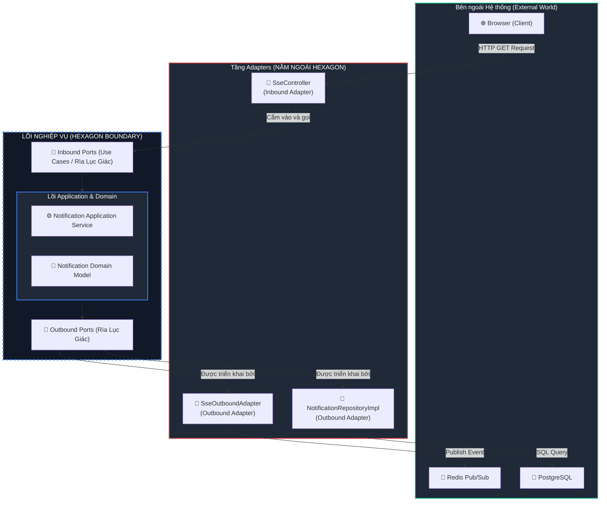
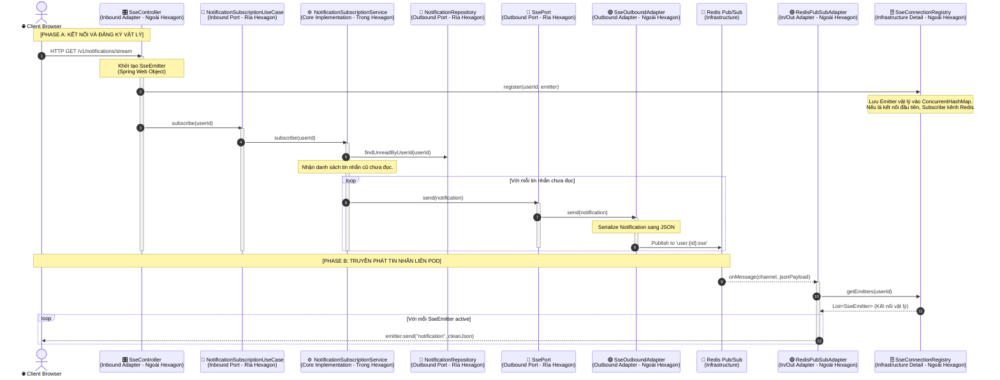

# 📡 Ports & Adapters Architecture Levels - Server-Sent Events (SSE)

Tài liệu này đặc tả kiến trúc **Ports & Adapters (Hexagonal Architecture)** áp dụng cho luồng truyền tin thời gian thực **Server-Sent Events (SSE)** theo từng cấp độ (Level) chi tiết. Mục tiêu cốt lõi là bảo vệ tầng **Application Core** hoàn toàn thuần khiết, độc lập tuyệt đối khỏi Spring Web Framework và các thư viện hạ tầng.

---

## 🗺️ LEVEL 1: HIGH-LEVEL BOUNDARY (Ranh giới Tổng quan)

Sơ đồ dưới đây sửa đổi lại **chính xác 100% theo triết lý Hexagonal Architecture chuẩn**:
*   **Hexagon (Hình Lục Giác)** đại diện cho **Application Core** (chứa Domain, Services và các Ports ở rìa).
*   **Tầng Adapters** nằm hoàn toàn **BÊN NGOÀI Hexagon**, đóng vai trò khớp nối (plug-in) cắm vào các Ports của lục giác để giao tiếp với thế giới bên ngoài (Client, Redis, DB).

---

## 🔌 LEVEL 2: PORTS & ADAPTERS COUPLING (Khớp nối Port & Adapter)

Cấp độ này mô tả chi tiết cách các **Adapters** (nằm bên ngoài) cắm vào các **Ports** (nằm ở rìa của Core) theo chiều ngang (Left-to-Right) để dễ theo dõi luồng dữ liệu.

```mermaid
graph LR
    subgraph Inbound_Side ["CHIỀU ĐI VÀO (INBOUND - NGOÀI HEXAGON)"]
        Browser_Client["🌐 Browser"] -->|1. HTTP GET /stream| In_Adapter_Sse["🔌 SseController<br>(Inbound Adapter)"]
    end

    subgraph Hexagon_Core ["LÕI HEXAGON (APPLICATION CORE)"]
        In_Port_Sub["🔌 NotificationSubscriptionUseCase<br>(Inbound Port - Rìa Hexagon)"] --> App_Service_Impl["⚙️ NotificationSubscriptionService<br>(UseCase Implementation)"]
        App_Service_Impl --> Out_Port_Sse["🔌 SsePort<br>(Outbound Port - Rìa Hexagon)"]
        App_Service_Impl --> Out_Port_DB["🔌 NotificationRepository<br>(Outbound Port - Rìa Hexagon)"]
    end

    subgraph Outbound_Side ["CHIỀU ĐI RA (OUTBOUND - NGOÀI HEXAGON)"]
        Out_Port_Sse -->|2. Được cắm bởi| Out_Adapter_Sse["🔌 SseOutboundAdapter<br>(Outbound Adapter)"]
        Out_Port_DB -->|2. Được cắm bởi| Out_Adapter_DB["🔌 NotificationRepositoryImpl<br>(Outbound Adapter)"]
        
        Out_Adapter_Sse -->|3. Publish| Redis_Engine["🔴 Redis Pub/Sub"]
        Out_Adapter_DB -->|3. SQL Query| DB_Postgres["💾 PostgreSQL"]
    end

    In_Adapter_Sse -->|Cắm vào và gọi| In_Port_Sub

    style Hexagon_Core fill:#1e1b4b,stroke:#818cf8,stroke-width:2px,color:#fff
    style Inbound_Side fill:#111827,stroke:#ef4444,stroke-width:1px,color:#fff
    style Outbound_Side fill:#111827,stroke:#10b981,stroke-width:1px,color:#fff
```

---

## 🛠️ LEVEL 3: COMPONENT SEQUENCE (Luồng chạy chi tiết của các Linh kiện)

Sơ đồ trình tự mô tả đường đi chi tiết của dữ liệu qua các class cụ thể dưới hạ tầng, giải quyết bài toán **Distributed SSE** và cô lập hoàn toàn đối tượng **`SseEmitter`** của Spring Web khỏi Core.

---

## 💎 ĐỊNH NGHĨA RANH GIỚI VẬT LÝ (FOLDER & PACKAGE BOUNDARIES)

Để đảm bảo không bao giờ xảy ra lỗi rò rỉ (leak) framework nữa, chúng ta thiết lập ranh giới phân bổ file nghiêm ngặt:

### 1. Vùng cấm Spring Web (Clean Core Zone)
Toàn bộ các file nằm dưới thư mục:
📂 `com.rentagf.notification.application/...`
📂 `com.rentagf.notification.domain/...`

> [!IMPORTANT]
> **LUẬT BẤT BIẾN:** Nghiêm cấm chứa bất kỳ import nào của `org.springframework.web` hoặc tham chiếu đến `SseEmitter` trong vùng này. Mọi dữ liệu đi qua vùng này phải là **POJO/Domain Model** thuần túy.

### 2. Vùng hạ tầng (Infrastructure & Interfaces Zone)
Toàn bộ các file nằm dưới thư mục:
📂 `com.rentagf.notification.infrastructure/...`
📂 `com.rentagf.notification.interfaces/...`

> [!NOTE]
> Đây là nơi chứa các adapters cụ thể (`SseController`, `SseConnectionRegistry`, `RedisPubSubAdapter`, `SseOutboundAdapter`). Các file trong vùng này được quyền import Spring Web, duy trì `SseEmitter` và kết nối Redis Pub/Sub vật lý.
