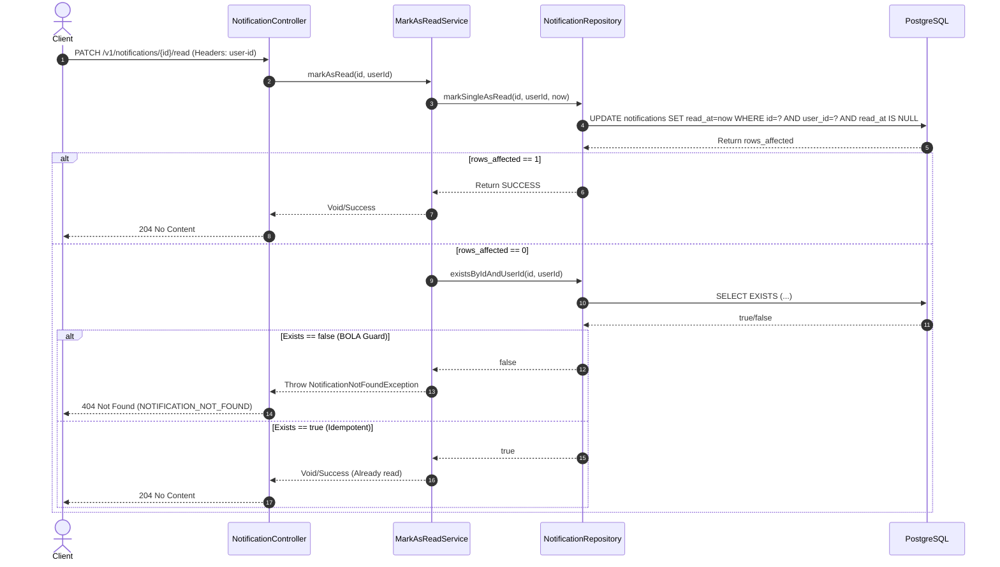

# 📑 PRODUCT REQUIREMENTS DOCUMENT (PRD) - PHASE 4: REST API

## 1. Tổng quan kỹ thuật
Tài liệu này định nghĩa chi tiết kiến trúc và đặc tả kỹ thuật cho việc triển khai **REST APIs** thuộc **Phase 4** trong dịch vụ **Notification Service**. 
Dịch vụ được xây dựng trên nền tảng **Java 21**, **Spring Boot 3.5.0**, áp dụng mô hình **Hexagonal Architecture (Kiến trúc Lục giác)** và tích hợp bảo mật **Istio Service Mesh**.

---

## 🎯 Ranh giới Dự án (Project Boundaries)

### 1. Phạm vi thực hiện (In-scope)
* **REST APIs Endpoints**:
  * `GET /v1/notifications`: Tải danh sách thông báo phân trang cursor-based, hỗ trợ tham số lọc `unreadOnly` và hiệu chỉnh giới hạn `limit`.
  * `PATCH /v1/notifications/{id}/read`: Đánh dấu đã đọc cho một thông báo cụ thể.
  * `PATCH /v1/notifications/read-all`: Đánh dấu đã đọc toàn bộ thông báo chưa đọc của người dùng.
* **Tactical DDD & Phân trang**:
  * Thiết lập Value Object `InboxCursor` (Java Record) lưu cặp `(createdAt, id)`.
  * Xây dựng `CursorCodec` sử dụng **JSON Serialization** (`ObjectMapper`) mã hóa/giải mã Base64 URL-safe.
  * Truy vấn cơ sở dữ liệu phân trang cursor-based kép chuẩn xác: `(created_at < :cursor OR (created_at = :cursor AND id < :cursorId))` kèm invariant `ORDER BY created_at DESC, id DESC`.
* **Bảo mật, Phân quyền & Tối ưu IO**:
  * Lấy `user-id` trực tiếp từ HTTP Header.
  * Chống tấn công BOLA/IDOR và **Tối ưu Row-level Update** bằng cơ chế Optimistic Update trực tiếp tại DB.
* **Idempotent Mark Read (`[INV-N08]`)**:
  * Đảm bảo không ghi đè `read_at` nếu thông báo đã được đọc từ trước.
* **Quản lý Transaction**:
  * Cấu hình `@Transactional` và `@Transactional(readOnly = true)` tường minh cho các Service.
* **Tối ưu hóa Database**:
  * Tạo Composite Index và Partial Index trên PostgreSQL để tối ưu hóa truy vấn phân trang và đếm chưa đọc.
* **Kiểm thử tự động (TDD)**:
  * Viết Unit Tests (Domain, Application, Interfaces) và Integration Tests (Persistence SQL, API End-to-End).

### 2. Nằm ngoài phạm vi (Out-of-scope)
* Giao tiếp Realtime SSE (Đã hoàn tất ở Phase 2).
* Consumer & Routing Engine (Đã hoàn tất ở Phase 3).
* Outbound Providers & Retry Execution (Thuộc Phase 5).
* Bất kỳ thay đổi DB schema nào khác ngoại trừ việc bổ sung các Index tối ưu hóa.

---

## 2. Kiến trúc Hexagonal & Phân chia Trách nhiệm (Single Responsibility)

Chúng ta tuân thủ nghiêm ngặt ranh giới giữa các Layer trong kiến trúc Hexagonal:

```mermaid
graph TD
    subgraph Interfaces [Interfaces Layer - HTTP Adapters]
        ctrl[NotificationController]
        exception[GlobalExceptionHandler]
    end

    subgraph Application [Application Layer - Business Workflows]
        in_port1[FetchInboxUseCase]
        in_port2[MarkAsReadUseCase]
        in_port3[MarkAllAsReadUseCase]
        
        service1[FetchInboxService]
        service2[MarkAsReadService]
        service3[MarkAllAsReadService]
    end

    subgraph Domain [Domain Layer - Pure Business Logic]
        agg[Notification Aggregate]
        repo_port[NotificationRepository Port]
        domain_err[Domain Exceptions]
        vo[InboxCursor & CursorCodec VO]
    end

    subgraph Infrastructure [Infrastructure Layer - Adapters]
        db_adapter[NotificationRepositoryImpl]
        jpa_repo[NotificationJpaRepository]
    end

    %% Giao tiếp
    ctrl --> in_port1
    ctrl --> in_port2
    ctrl --> in_port3

    in_port1 ..|> service1
    in_port2 ..|> service2
    in_port3 ..|> service3

    service1 --> repo_port
    service2 --> repo_port
    service3 --> repo_port

    db_adapter ..|> repo_port
    db_adapter --> jpa_repo
```

### 2.1. Domain Layer (`domain/`)
- **Notification Aggregate Root**: Khối xây dựng nghiệp vụ cốt lõi.
- **Value Object `InboxCursor`**: Định nghĩa Java Record `{"createdAt": "...", "id": "..."}`.
- **Utility `CursorCodec`**: Bộ mã hóa/giải mã cấu trúc cursor sử dụng JSON + Base64 an toàn.
- **NotificationRepository (Port)**: Định nghĩa hợp đồng truy vấn, update, và exists.
- **Domain Exceptions**: `NotificationNotFoundException`, `InvalidCursorException`.

### 2.2. Application Layer (`application/`)
- **`FetchInboxService`**: `@Transactional(readOnly = true)`. Xử lý `CursorCodec`, gọi Repository, đóng gói Metadata.
- **`MarkAsReadService`**: `@Transactional(rollbackFor = Exception.class)`. Thực thi Optimistic Update qua Repository, và Fallback query existence.
- **`MarkAllAsReadService`**: `@Transactional(rollbackFor = Exception.class)`. Gọi trực tiếp Repository thực thi cập nhật bulk.

---

## 3. Thiết kế Cursor-based Pagination ([INV-N06])

### 3.1. Cấu trúc và Định dạng của Cursor
Cursor được đóng gói theo chuẩn JSON và mã hóa Base64 URL-safe không padding:
$$\text{Cursor String} = \text{Base64UrlSafe}(\text{JSON}\{"createdAt": "...", "id": "..."\})$$
*Lợi ích*: Robust, chống lỗi delimiter (fragile serialization), future-proof (có thể thêm sort fields khác trong tương lai).

### 3.2. Thuật toán Phân trang phía DB & ORDER BY Invariant
Để thuật toán Cursor đúng đắn, **MỌI** truy vấn trả về mảng phân trang bắt buộc phải kết thúc với **ORDER BY Invariant**:
`ORDER BY created_at DESC, id DESC`

```sql
SELECT * FROM notifications 
WHERE user_id = ? 
  AND (? = false OR read_at IS NULL)
  AND (created_at < ? OR (created_at = ? AND id < ?))
ORDER BY created_at DESC, id DESC
LIMIT ?
```

---

## 4. Tối ưu hóa Row-level Update (Optimistic Update cho Mark As Read)

### 4.1. Vấn đề Truyền thống
Truy vấn `SELECT` -> kiểm tra -> `UPDATE` tiêu tốn 2 Database Round-trips.

### 4.2. Giải pháp Optimistic Update
Thực thi trực tiếp Update có điều kiện cực kỳ mạnh mẽ:
```sql
UPDATE notifications SET read_at = :now, updated_at = :now 
WHERE id = :id AND user_id = :userId AND read_at IS NULL
```
- DB sẽ trả về `rows_affected`.
- Nếu `rows_affected == 1`: Update thành công.
- Nếu `rows_affected == 0`: Gọi fallback câu `EXISTS(SELECT 1 FROM notifications WHERE id = :id AND user_id = :userId)`.
  - Nếu `EXISTS = true` -> Bản ghi có thật và đã đọc từ trước -> Xử lý thành công (Idempotent theo `[INV-N08]`).
  - Nếu `EXISTS = false` -> Ném `NotificationNotFoundException` (Che giấu ID, ngăn chặn BOLA).
- **Lợi ích**: 95% request tốn đúng 1 lượt IO (round-trip). Chỉ khi client gọi spam vào các item đã đọc rồi thì mới mất 2 lượt IO. Tối ưu hóa cực đại cho Database.

---

## 5. Cấu trúc Cơ sở Dữ liệu & Thiết kế Index Tối ưu (Database Indices)

### 5.1. Composite Index cho Inbox Phân trang Toàn bộ
```sql
CREATE INDEX idx_notifications_inbox 
ON notifications (user_id, created_at DESC, id DESC);
```

### 5.2. Partial Index (Index bán phần) cho Inbox Chưa đọc
```sql
CREATE INDEX idx_notifications_unread_inbox 
ON notifications (user_id, created_at DESC, id DESC) 
WHERE read_at IS NULL;
```

---

## 6. Chi tiết Đặc tả các API Endpoints

### 6.1. GET /v1/notifications (Fetch Inbox)
- **HTTP Method**: `GET`
- **Path**: `/v1/notifications`
- **Headers**: `user-id`: `UUID` (bắt buộc).

#### Cấu trúc Response (200 OK):
```json
{
  "data": [
    {
      "id": "e48d3c12-3211-47bb-84a1-b847a95015b6",
      "userId": "22222222-3333-4444-5555-666666666666",
      "eventId": "evt_123",
      "type": "TRANSACTIONAL",
      "priority": "HIGH",
      "payload": {
        "title": "Thanh toán thành công"
      },
      "status": "PENDING",
      "readAt": null,
      "createdAt": "2026-05-24T09:30:00Z",
      "updatedAt": "2026-05-24T09:30:00Z"
    }
  ],
  "paging": {
    "nextCursor": "eyAiY3JlYXRlZEF0IjogIi4uLiIsICJpZCI6ICIuLi4iIH0",
    "hasMore": true
  }
}
```

---

### 6.2. PATCH /v1/notifications/{id}/read (Mark Single Read)
- **HTTP Method**: `PATCH`

#### Sequence Diagram xử lý Mark Single Read (Optimistic Update + BOLA Guard):



---

## 7. Chuẩn hóa Lỗi & Định nghĩa Mã lỗi (Error Mapping)

| Tên ngoại lệ (Exception Class) | Mã lỗi (Error Code) | HTTP Status | Giải thích ngữ cảnh |
| :--- | :--- | :--- | :--- |
| `InvalidCursorException` | `INVALID_CURSOR` | `400 Bad Request` | Định dạng cursor truyền lên không phải Base64 URL-safe, JSON sai cấu trúc, hoặc parse thất bại. |
| `NotificationNotFoundException` | `NOTIFICATION_NOT_FOUND` | `404 Not Found` | ID thông báo không tồn tại trong DB, HOẶC thuộc về `userId` khác (BOLA). |
